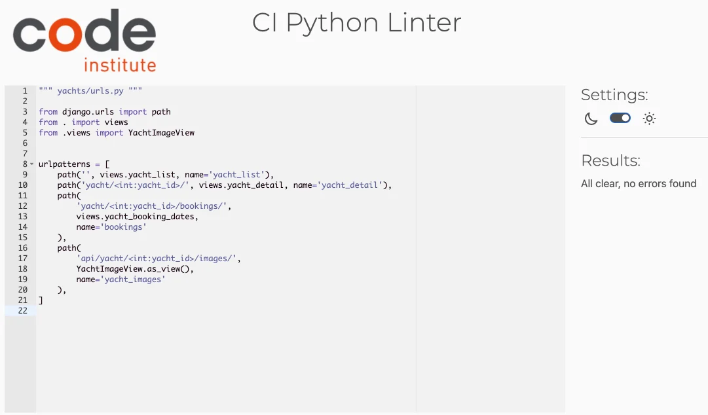
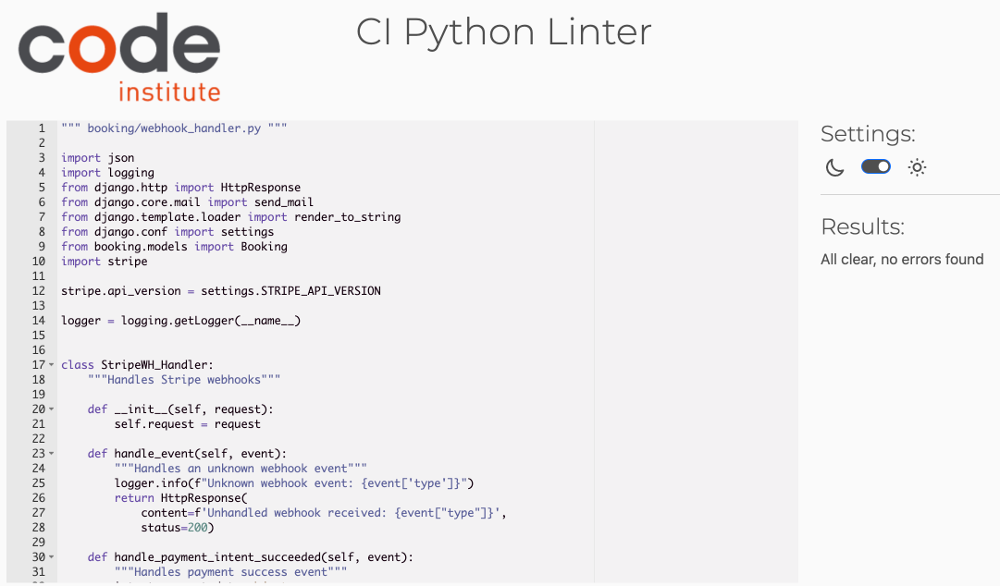

# Yachtsescape README


View the live site [here](https://yachtsescape-a7b4e5d759f6.herokuapp.com/)

## Introduction

Welcome to YachtsEscape, your premier destination for discovering and booking luxury yacht rentals. Our platform is designed to provide users with an effortless experience, from searching for the perfect yacht to securing your booking. Whether you're planning a tranquil getaway or an adventurous voyage, YachtsEscape.com offers a wide selection of yachts to suit every preference.

## UX

The website was designed to be both visually appealing and easy to navigate. Users can quickly browse through a wide selection of yachts and find the one that fits their needs. The focus is on providing a seamless experience, allowing users to book yachts without any hassle. The website's layout is simple and intuitive, ensuring that users can understand and use it effortlessly. Special deals and offers are highlighted to encourage users to make bookings and become repeat customers. The site is also built with scalability in mind, making it adaptable for future growth and allowing the management team to handle different roles efficiently.

## Target Audience

This website is designed for people who are looking to rent yachts for various occasions, such as leisure trips, celebrations, or fishing adventures. It aims to attract both casual users who are booking for the first time, and loyal customers who enjoy regular yacht trips. We make it easy to search for yachts by type, location, and capacity, ensuring that users can find the perfect fit for their needs. The website also offers special deals and a smooth booking process, making yacht rentals accessible and hassle-free for everyone.

## Business Model

The business model is B2C, meaning that the company focuses on offering yacht rentals directly to customers. It emphasizes individual transactions, allowing customers to browse, select, and book yachts easily.

### Revenue Streams

The primary revenue stream for **YachtsEscape** comes from yacht rentals. Additional revenue is generated through premium services, such as luxury packages or extended rental periods, and potential partnerships with yacht owners for exclusive listings.

### Customer Acquisition Strategy

**YachtsEscape** attracts customers through targeted online marketing campaigns, search engine optimization (SEO), and partnerships with travel agencies. Additionally, repeat customers are encouraged to use the platform through loyalty programs and special discounts.

### Partnerships

The platform builds strategic partnerships with yacht clubs, marina operators, and event planners to offer customers an all-inclusive experience. These partnerships allow the platform to expand its range of yachts and provide unique packages for special occasions.

### A Persona Summary of the Customer

**YachtsEscape** caters to individuals looking for yacht rentals for various purposes, including leisure, celebrations, or fishing trips. The typical customer is someone 18 or older, seeking a unique experience on the water. The platform is designed with user-friendliness in mind, making it easy for customers to find the right yacht based on their needs, compare options, and receive excellent service throughout the process. Customers value the clear yacht descriptions, high-quality images, and simple booking process.

### A Persona Summary of the Company Personnel

**YachtsEscape** aims to support small and large companies interested in offering yacht rentals. As the platform scales, it includes features for personnel to manage listings, bookings, and customer service effectively. Admins and managers can oversee everything from adding new yachts, updating details, and handling bookings to managing customer inquiries and ensuring smooth operations.

### Value Proposition

**YachtsEscape** offers a curated selection of yachts for every occasion, from intimate family trips to large-scale celebrations. The platform’s ease of use, combined with its extensive yacht options and top-tier customer service, ensures that customers have a premium experience from start to finish.

### Key Metrics

The platform focuses on key metrics such as:
- Number of bookings per month
- Customer satisfaction ratings
- Repeat customer rate
- Yacht availability and maintenance levels
- Time spent on the platform by users

### Growth Plan

The future growth plan includes expanding the range of yachts available to cover more regions and offering new features like yacht-related experiences (e.g., guided tours or fishing expeditions). The platform will also invest in improving its user interface, ensuring a seamless experience for mobile users.

## Mindmap of YachtsEscape.com


## Project Goals

The primary goal of YachtsEscape.com is to make yacht rentals accessible and straightforward for both users and administrators. Our objectives include:

1. **User-Friendly Yacht Search**: Provide a seamless search experience for users, allowing them to find available yachts quickly and easily by filtering results based on location, date, price, and other preferences.

2. **Streamlined Booking Process**: Ensure that users can book yachts effortlessly, with a clear and intuitive process that includes instant booking confirmations and secure payment options.

3. **Comprehensive Yacht Information**: Offer detailed and accurate information about each yacht, including photos, specifications, and user reviews, helping users make informed decisions.

4. **Efficient Account Management**: Empower users to manage their accounts effectively, including access to booking history, saved yachts, and personalized settings, ensuring a personalized experience.

5. **Proactive User Engagement**: Keep users engaged with notifications about new yachts, special offers, and promotions, encouraging them to return and explore more options regularly.

6. **Robust Admin Tools**: Equip administrators with the tools they need to manage yacht listings, user accounts, bookings, and payments efficiently, maintaining the accuracy and integrity of the platform.

7. **Reliable Reporting and Analytics**: Provide administrators with comprehensive reporting features to analyze user activity, booking trends, and financial transactions, enabling data-driven decisions for platform improvement.

Our mission is to create a platform that not only simplifies the yacht rental process but also enhances the overall experience for both users and administrators, ensuring a smooth and enjoyable journey from search to booking.

## User Stories

### First Time Visitor

| Issue ID | User Story |
|----------|------------|
| #1       | As a First Time Visitor, I want to quickly understand what YachtsEscape is, so that I can start exploring yacht rental options without feeling lost. |
| #2       | As a First Time Visitor, I want to easily search for available yachts by location and date, so that I can find the perfect yacht without any hassle. |
| #3       | As a First Time Visitor, I want detailed information about each yacht, including photos, specifications, and reviews, so that I can make an informed decision. |
| #4       | As a First Time Visitor, I want to learn more about the company, so that I can feel confident in renting a yacht from them. |
| #5       | As a First Time Visitor, I want to easily find the company's contact information, so that I can reach out with any questions. |

### Returning Visitor

| Issue ID | User Story |
|----------|------------|
| #6       | As a Returning Visitor, I want to log back in and pick up where I left off, so that I can continue my yacht search or finalize a booking. |
| #7       | As a Returning Visitor, I want to quickly rebook a yacht I’ve rented before, so that I don’t have to search for it again. |
| #8       | As a Returning Visitor, I want to manage my wishlist easily, so that I can keep track of yachts I’m interested in. |
| #9       | As a Returning Visitor, I want to subscribe to updates about new yacht listings and special offers, so that I can stay informed. |

### Registered User

| Issue ID | User Story |
|----------|------------|
| #10      | As a Registered User, I want to receive notifications about new yachts, discounts, and promotions, so that I can stay ahead of the best deals. |
| #11      | As a Registered User, I want to manage my account settings and preferences easily, so that I can tailor the experience to my needs. |
| #12      | As a Registered User, I want to quickly access my booking history, so that I can review past rentals or rebook a favorite yacht. |

### Admin

| Issue ID | User Story |
|----------|------------|
| #13      | As an Admin, I want to keep the yacht listings up to date, so that users always see accurate and available options. |
| #14      | As an Admin, I want to manage user accounts, so that I can maintain the integrity of the platform. |
| #15      | As an Admin, I want to manage all bookings, so that I can help users and keep everything organized. |
| #16      | As an Admin, I want to track and manage payments, so that I can ensure all transactions are processed correctly. |
| #17      | As an Admin, I want to generate reports on user activity, bookings, and payments, so that I can make informed decisions about future improvements. |

## MoSCoW Prioritization

I used MoSCow prioritization to organize each iteration of my project.

### Must Have

- **Design and implement a relational data model**: I'll need to design the database structure that fits the needs of the yacht rental service, making sure it can store, manage, and manipulate all relevant data.
  
- **Authentication, authorization, and permission features**: It’s essential that I handle who can log in, what they can do, and protect sensitive areas of the site. I’ll be making sure that only authorized users can make bookings or manage content.

- **E-commerce payment system**: I'll implement a payment system that allows users to securely book and pay for yacht rentals directly through the site.

- **Use version control (Git) and deploy to the cloud**: I’m documenting everything in Git, making regular commits, and hosting the project on a cloud platform like Heroku.

### Should Have

- **Full-stack web app using Django**: I’ve designed a multi-app Django project with a relational database and user interactions.

- **Accessible and user-friendly front-end**: I'm ensuring the site is designed with accessibility in mind and provides a smooth user experience.

- **Forms for users**: I'll have forms with validation, allowing users to submit and edit information easily.

- **Clean code**: I'll make sure the code follows Django conventions and is easy to maintain.

- **Custom Python logic**: I'll include Python functions with logic like loops and conditions to handle the yacht rental process and bookings efficiently.

- **Testing**: I'll run tests to check that everything works properly—from responsiveness to data management.

- **Database design**: I've created a database schema that shows clear relationships between yachts, users, and bookings.

- **CRUD functionality**: I'll provide the ability to create, read, update, and delete records like yachts and bookings, making sure the system works smoothly for both admins and users.

### Won’t Have

- **Referral system**: This feature is something I’m skipping for now, as it’s not critical to the core of the project.

## Project Setup
### 1. Commitizen Setup
- Installed **Commitizen** and **cz-customizable** for standardized commit messages.
- Created and configured `.cz-config.js` to define commit types and scopes.

### 2. Virtual Environment
- Created a virtual environment for the project to manage dependencies.
- Added the `env` directory to `.gitignore` to prevent tracking of the virtual environment files.

### 3. Django Installation
- Installed **Django** version 5.1.1 to start developing the application.

### 4. Project Initialization
- Began the project setup for YachtsEscape.com, aimed at providing a platform for yacht rentals.

#### Running the Django Application

To start the Django application, follow these steps:

1. **Activate the Virtual Environment:**
   Make sure your virtual environment is activated. Run the following command:

   - **For Windows:**
     ```bash
     .\env\Scripts\activate
     ```

   - **For macOS and Linux:**
     ```bash
     source env/bin/activate
     ```

2. **Run the Development Server:**
   Once the virtual environment is activated, you can start the Django development server with the following command:

   ```bash
   python3 manage.py runserver

## User Experience (UX) & User Interface (UI)

### Wireframes

<details>
<summary>Home Page</summary>


</details>

<details>
<summary>Log in Page</summary>


</details>

<details>
<summary>Sign Up Page</summary>


</details>

<details>
<summary>Our Fleet Page</summary>


</details>

<details>
<summary>About Us Page</summary>


</details>

<details>
<summary>Profile Page</summary>


</details>

<details>
<summary>Yacht management Page</summary>


</details>

<details>
<summary> Yacht Detail Page</summary>


</details>

<details>
<summary>Booking success Page</summary>


</details>
<summary>Map of website</summary>


</details>

### Colour Scheme

#### Color Palette
The color palette for YachtsEscape was chosen to give the site a clean, professional look, while keeping it tied to the theme of yachting. Here are the main colors:

- **Primary Color:** #088cdc (Light Blue) – Inspired by the sea, this color feels fresh and calm. It's used for buttons, icons, and other important elements to give the site a bright, welcoming feel.
- **Secondary Color:** #006bb3 (Deep Blue) – This darker blue adds depth and trust. It's used for the logo, hover states, and interactive elements.
- **Text Color:** #444444 (Dark Grey) – Used for main body text, this grey keeps things readable without being too harsh.
- **Background Color:** #f8f8f8 (Light Grey) – A soft, neutral background that lets the content shine without being distracting.
- **White:** Mainly used for text on dark backgrounds like the footer and image sections, creating strong contrast for easy reading.
- **Footer Background:** #000000 (Black) – The footer uses black to make the white text stand out and give the site a solid base.

#### Visual Harmony and Accessibility
- **Contrast and Readability:** High contrast between text and background ensures everything is easy to read. The white text on dark sections like the footer improves visibility.
- **Balance:** Blue dominates the design, while grey and white keep the layout clean and focused.
- **Consistency:** The color scheme is consistent throughout, reinforcing the brand identity and making navigation intuitive.
- **Accessibility:** The colors meet accessibility standards, ensuring the site is usable for everyone, including those with visual impairments.


#### Visual Harmony and Accessibility

- **Contrast and Readability**: Ensure there is sufficient contrast between the primary color (Green) and the accent color (White) for text and important elements to maintain readability.
- **Balance**: Use soft orange sparingly to highlight key actions without overwhelming the natural and calm aesthetic of the site.
- **Consistency**: Maintain a consistent use of colors throughout the website to create a harmonious visual experience that supports the site’s calming and professional atmosphere.
- **Accessibility**: Consider accessibility guidelines, ensuring that all text is readable by maintaining an appropriate contrast ratio and using color combinations that are friendly for users with color vision deficiencies. This includes testing the color palette with accessibility tools to verify compliance with WCAG standards.

### Typography

The primary font used throughout the site is [**Lato**](https://fonts.google.com/specimen/Lato), a Google Font, chosen for its clean and modern look, ensuring readability across all devices. It comes in various weights (100, 300, 400, 700, 900) to give flexibility in styling headings, body text, and other elements.


For icons, I use [**Font Awesome**](https://fontawesome.com/), which adds clarity and visual appeal to buttons, social media links, and navigation elements.

### YachtsEscape Logo

The **YachtsEscape** logo features a sleek, modern design with a minimalist illustration of a yacht, combined with bold typography. The yacht symbol uses a clean blue (#088cdc) color, which represents the ocean, aligning with the overall maritime theme of the website. The bold black text beside the yacht adds a professional touch, making the brand name stand out clearly.

There are two variations of the logo:

- **Light Version**: This version is used against dark backgrounds, such as in the initial state of the header and in the footer of the website.
- **Dark Version**: This version appears against lighter backgrounds, such as when the user scrolls down and the header becomes fixed on a white background.


The logo dynamically changes between these versions based on the user's scroll position and screen width, enhancing the website's aesthetic and functionality.

Below is the JavaScript code that switches between the light and dark versions of the logo as the user interacts with the page:

```javascript, static/js/base.js
// Function to change the logo based on scroll position and window width
function updateLogo() {
    let windowWidth = $(window).width();
    let scrollTop = $(window).scrollTop();
    let lightLogo = $("#logo").data("light-logo");
    let darkLogo = $("#logo").data("dark-logo");
    let smallLightLogo = $("#logo").data("small-light-logo");
    let smallDarkLogo = $("#logo").data("small-dark-logo");

    if (scrollTop > scrollTrigger) {
        // Change logo to dark version based on screen size
        if (windowWidth < 689) {
            $("#logo").attr("src", smallDarkLogo);
        } else {
            $("#logo").attr("src", darkLogo);
        }
    } else {
        // Change logo to light version based on screen size
        if (windowWidth < 689) {
            $("#logo").attr("src", smallLightLogo);
        } else {
            $("#logo").attr("src", lightLogo);
        }
    }
}
```

## Features

### Navigation
The navigation panel of Yachtsescape rental website is designed to provide a user-friendly and intuitive browsing experience.

#### Navbar
The Navbar is composed of two main parts: the **Top Bar** and the **Main Navigation**.

##### Top Bar
The **Top Bar** provides quick access to essential contact information and social media links:


- **Phone and Email**: 
  - Users can quickly dial the phone number or email YachtsEscape with one click from the top bar.
  - These contact options are visible on all screen sizes, ensuring accessibility.
  
- **Social Media Links**: 
  - Links to Twitter, Facebook, Instagram, and YouTube are available, each opening in a new window. The icons are styled using FontAwesome and aligned on the right of the top bar for convenience.

##### Main Navigation
The **Main Navigation** is designed to be responsive and intuitive:


- **Brand Logo**: 
  - The logo is positioned on the left side of the navbar, dynamically changing based on scrolling. When the user scrolls past 50px, the logo transitions from light to dark (or small versions on mobile), thanks to the custom JavaScript code in `base.js`.

- **Menu Behavior**: 
  - The menu adapts responsively, converting into an off-canvas (sidebar) menu on smaller devices. The menu's hamburger icon becomes visible on mobile devices, ensuring the navigation is accessible across screen sizes.
  
- **Dynamic Menu Based on User Status**:
  - If the user is authenticated, an account dropdown is displayed with links to profile for all users and management pages for admin users.


  - If the user is not authenticated, a **Sign In** button appears instead.


- **Yacht Fleet Menu**: 
  - The **Our Fleet** section is a dropdown that categorizes yachts by type (Leisure, Fishing, Celebrations), allowing users to filter yachts according to their preferences.


- **Filter Yachts Button**: 
  - A prominent **Book Now** button is available, leading to a modal with a filter form. This form allows users to filter yachts by type, capacity, and availability using intuitive date pickers.


##### Layout and Responsiveness

- The **Main Navigation** and **Top Bar** are designed to collapse elegantly on smaller screens, with all elements accessible via the off-canvas sidebar.


- The **Logo**, **Menu Items**, and **Filter Yachts** button are designed to shift layout based on screen size, ensuring a consistent and responsive experience for users on all devices.


The navigation ensures quick access to essential services and an intuitive flow, enhancing the user journey across the site.

### Footer

The footer section of **YachtsEscape** provides essential information, including contact details and easy access to our social media channels. Here's a breakdown of its layout and functionality across different devices:

##### Desktop View:


- **Logo and Company Name**: 
  - Positioned on the left side of the footer, the **YachtsEscape** logo is displayed prominently to enhance brand visibility.

- **Navigation Links**:
  - Located centrally, visitors can find key navigation links such as:
    - Home
    - My Profile (if logged in)
    - Our Fleet
    - About Us

- **Contact Information**: 
  - On the right, contact details include:
    - **Phone**: +44 7990 278555
    - **Email**: support@yachtsescape.com
    - **Address**: 123 Marina Blvd, Mediterranean Coast

- **Social Media Icons**:
  - Social media icons for Instagram, Facebook, Twitter, and YouTube provide quick access to our profiles.

- **Copyright**:
  - The footer includes a copyright notice: "© 2024 Artem Bryzh. All rights reserved." 
  - A link to the LinkedIn profile of the site creator is also provided.

##### Tablet View:


- **Logo and Navigation Links**:
  - The logo and navigation links are centrally aligned for a balanced layout.

- **Contact Information**:
  - Positioned similarly to the desktop version, but more compact.

- **Social Media Icons**:
  - Icons are displayed below the contact information, allowing easy access on medium-sized screens.

##### Mobile View:


- **Logo**: 
  - The **YachtsEscape** logo is centrally placed at the top for brand recognition.

- **Navigation Links**: 
  - Displayed in a simplified vertical layout for easier navigation.

- **Contact Information**: 
  - Aligned centrally, with the same phone, email, and address details.

- **Social Media Icons**:
  - Arranged horizontally, ensuring users can easily find and interact with them on smaller screens.

The footer is fully responsive and designed to provide a seamless experience across all device types, ensuring users can quickly find essential information and stay connected through social media.

### Home Page


The home page of **YachtsEscape** is designed to provide a seamless and informative experience for users looking to rent yachts. Below is a detailed description of its sections and features:

#### Introduction Section:
- **Hero Section**: 
  - Includes a welcome message and a prominent button labeled "Explore More" that links to the "About Us" page.
  - The background features a large, visually appealing image, creating an immersive experience for users.

#### Search Form Section:
- **Search for Yachts**: 
  - A form allowing users to filter yachts by boat type, capacity, and location, making it easy to find the right yacht.
  - Includes dropdown menus for:
    - Boat type (Celebrations, Fishing, Leisure)
    - Capacity (Up to 8, More than 8)
    - Location (Turkey, France, Spain)

#### Featured Services Section:
- **Introduction to Services**: 
  - Highlights the company's commitment to providing a premium fleet of yachts.
  - Features a list of benefits, such as:
    - Stunning Cruise Paths
    - Premium Boats & Yachts
    - Professional Approach
    - Quality Service

#### Core Benefits:
- **Icons Representing Three Key Benefits**:
  - **Priceless Experience**: Luxury and relaxation through premium services.
  - **Custom Packages**: Tailored packages to meet diverse needs.
  - **People-Oriented Service**: Customer satisfaction is a top priority.

#### Featured Yachts:
- **Featured Yachts Section**: 
  - Displays a selection of featured yachts with images, names, prices, and locations.
  - Includes a "View Details" button for each yacht, allowing users to learn more about individual yachts.

#### Deal of the Week:
- **Exclusive Offer**: 
  - Features a "Deal of the Week" yacht with a limited-time offer, encouraging users to take advantage of the special price.
  - Provides key details such as location, type, capacity, and price.

#### Testimonials:
- **Customer Reviews**: 
  - A carousel featuring testimonials from satisfied customers who share their experiences with **YachtsEscape**.
  - Each testimonial includes a photo of the customer and a short review.

The home page provides an inviting and user-friendly interface that highlights the best of **YachtsEscape's** offerings, guiding users through the yacht rental process with ease.

### Sign In Page


The **YachtsEscape** Sign In page allows users to log into their accounts quickly and easily. It includes the following features:

1. **Username Input**: 
   - Field for entering the username.

2. **Password Input**: 
   - Field for entering the password.

3. **Sign In Button**: 
   - Submits the form to log the user in.

4. **Home Button**: 
   - Returns the user to the homepage without logging in.

5. **Forgot Password Link**: 
   - Provides a link to reset the password.

6. **Sign Up Prompt**: 
   - A link to sign up for new users.

If the credentials are valid, the user is logged in; otherwise, an error message is displayed. The page is simple and responsive, ensuring easy access on any device.

### Sign Up Page
The sign-up page allows new users to create an account on The Knee Surgery website. The form includes client-side validation using JavaScript to ensure the password meets the criteria and matches the confirmation password. The backend handles additional validation, password hashing, and user creation.


The page includes the following features:

1. **Full Name Input**: Users enter their full name in a floating label input field.
2. **Gender Selection**: Users select their gender from a dropdown list.
3. **Date of Birth Input**: Users enter their date of birth in a floating label input field.
4. **Phone Number Input**: Users enter their phone number, which must be between 9 to 11 digits. JavaScript handles input changes to show or hide a sample text.
5. **Email Input**: Users enter their email address in a floating label input field.
6. **Password Input**: Users create a password with requirements displayed below the input field. The password must be at least 8 characters long, contain an uppercase letter, and a number. JavaScript validates the password in real-time. Gray check marks turn green as each requirement is met.


7. **Confirm Password Input**: Users confirm their password. JavaScript ensures that both password fields match. Each password field includes a Font Awesome eye icon that toggles password visibility when clicked.


8. **Terms and Conditions Checkbox**: Users must agree to the terms and conditions. Clicking the link opens a modal with the terms for review.


Users must agree to the terms and conditions. Without checking this box, users cannot complete the registration.


On the backend, the following occurs:

- **Email Validation**: The backend checks if the email is already registered.
- **Password Validation**: The backend ensures the passwords match and meet the requirements.
- **Password Hashing**: The password is hashed using `generate_password_hash`.
- **User Creation**: A new user record is created and saved in the database.
- **Session Handling**: The user's email is added to the session to log them in automatically.

### Privacy Policy Page
The Privacy Policy page provides detailed information about how The Knee Surgery website collects, uses, and protects user data. It is a crucial component for informing users about their privacy rights and the measures taken to safeguard their information. 

<details>
<summary>See Privacy policy Page</summary>


</details><br>
  
The policy includes sections on:

- **Data Collection**: Explains what personal data is collected, such as email addresses, names, phone numbers, and usage data.
- **Usage of Data**: Describes how the collected data is used to provide and improve services.
- **Cookies and Tracking**: Details the use of cookies and other tracking technologies to enhance user experience.
- **Data Sharing**: Outlines conditions under which user data may be shared with third parties.
- **Data Security**: Ensures the protection of personal data, though it acknowledges no method is 100% secure.
- **Children’s Privacy**: States the service does not address users under 13 and the measures taken if such data is inadvertently collected.
- **External Links**: Advises users to review privacy policies of linked websites not operated by The Knee Surgery.
- **Policy Changes**: Notifies users that the Privacy Policy may be updated and the process for informing users of changes.

This Privacy Policy was generated and adapted using the [Privacy Policy Generator](https://www.termsfeed.com/privacy-policy-generator/).

### Our Doctors Page
The "Our Doctors" page features images and brief information about our doctors, including their specialties and experience. This page dynamically updates with new doctors added by the admin through a for loop, ensuring the latest information is always displayed.


The page layout includes:

- **Doctor Image**: Displays the doctor's image if available; otherwise, a default image is shown.
- **Doctor Information**: Presents the doctor's name, specialty, description, and additional information.

The page structure is generated automatically from the database entries using the following template code snippet:

      ```html
      
      <div class="col-12">
        <div class="card mb-3">
          <div class="row g-0">
            <div class="col-md-4">
              
            </div>
            <div class="col-md-8">
              <div class="card-body">
                <h3 class="card-title">{{ doctor.name }}</h3>
                <p class="card-text">{{ doctor.specialty }}</p>
                <p class="card-text">{{ doctor.description }}</p>
                <p class="card-text-hide">{{ doctor.additional_info }}</p>
              </div>
            </div>
          </div>
        </div>
      </div>
      
      ```

### About us Page
The "About Us" page for The Knee Surgery website provides comprehensive information about the clinic, its history, and its commitment to providing high-quality orthopedic care.

- **Introduction**
  - A welcoming message with a brief history and the clinic's dedication to patient satisfaction and medical excellence.


- **Carousel Section**
  - A Bootstrap carousel showcasing four key areas of the clinic:
    1. **Reception at Our Clinic**: Warm and inviting environment for patients.
    2. **Our Hospital Corridor**: Modern and convenient clinic facilities.
    3. **Operating Theatre**: Equipped with the latest medical technology.
    4. **Hospital Room**: Comfortable and modern environment for patients.

For optimal viewing experience, different images are used for various screen sizes, ensuring clarity and quality on all devices.

**Detailed Descriptions**
  - **Our Journey**: The history of the clinic and its growth over the past decade.
  - **Our Commitment to Quality**: Focus on personalized treatment plans and understanding patient needs.
  - **Patient Satisfaction**: Testimonials and the dedication of the staff to provide excellent care.
  - **Continuous Improvement**: Ongoing training and certification programs for doctors.
  - **Our Community**: Involvement in the local community through health fairs and educational seminars.
  - **Looking to the Future**: Commitment to innovation and expanding services.

As we continue to grow and evolve, we are excited to share that we have plans to enhance our “About Us” page further. In the near future, we aim to include testimonials from our patients, offering firsthand accounts of their experiences and the positive impact our clinic has had on their lives. These testimonials will provide valuable insights and reinforce the trust and satisfaction our patients feel.

Additionally, we will be showcasing our certifications and achievements in the medical field. By highlighting the qualifications and accolades of our dedicated team, we aim to demonstrate our commitment to excellence and continuous improvement. These additions will give visitors a more comprehensive understanding of our clinic’s dedication to providing exceptional orthopedic care.

### Profile Page

#### Patient Profile Page

The patient profile page on our website offers a comprehensive view of the patient's personal information, medical records, and appointment management. Here is an overview of what the patient can do and see on this page:


##### Key Sections:

1. **User Information**
   - **Name:** Displays the patient's name, with an option to edit.
   - **Role:** Shows the user's role as a patient.
   - **Phone:** Shows the patient's phone number, with an option to edit.
   - **Email:** Displays the patient's email, with an option to edit.
   - **Gender:** Shows the patient's gender.
   - **Date of Birth:** Displays the patient's date of birth.

2. **Change Password**
   - Patients can change their password by providing the current password and setting a new one, ensuring it meets security requirements.

3. **Medical Records**
   - **List of Medical Records:** Displays detailed information about the patient's medical history, including descriptions, treatments, dates, and the attending doctor's details.
   - **Download and Delete Files:** Patients can view, download, and delete their uploaded files related to their medical records.

4. **Scheduled Appointments**
   - **View Scheduled Appointments:** Displays the list of upcoming appointments with doctors, including the doctor's name, reason for the visit, and scheduled date and time.

5. **Requested Appointments**
   - **List of Appointment Requests:** Shows the appointments that the patient has requested, including the reason and current status of each request.

6. **Request an Appointment**
   - **Form to Request Appointments:** Allows patients to request new appointments by providing the reason for the visit.

This page is designed to be user-friendly, providing patients with easy access to their medical information and appointment management tools.

#### Admin Profile Page

The admin profile page on our website is designed to provide a comprehensive set of tools for managing user information, medical records, and appointments. Here's a breakdown of the key features and functionalities available to administrators:


##### Key Sections:

1. **User Information**
   - **Name:** Displays the admin's name with an option to edit.
   - **Role:** Shows the user's role as an admin, with the ability to edit.
   - **Phone:** Displays the admin's phone number, which can be edited.
   - **Email:** Shows the admin's email address, with an option to update it.
Administrators have enhanced privileges within the system. They can edit any information in their own profile or in any profile they view without needing to input the current password.

2. **Change Password**
   - Admins can securely change their password by entering the current password and setting a new one, ensuring it meets security requirements.

3. **Appointment Requests**
   - **List of Appointment Requests:** Displays all pending appointment requests from patients, including the patient's name and the reason for the appointment.
   - **Assign Doctor:** Allows admins to assign doctors to specific appointment requests, facilitating efficient scheduling and management.

4. **Admin-Specific Actions**
   - **View All Users:** A button that navigates to a page where admins can view and manage all users and doctors in the system.
   - **Add a New Doctor:** A button that links to a form where admins can add new doctors, expanding the clinic's team.

5. **Uploaded Files**
   - **Manage Files:** Admins can view, download, and delete uploaded files related to patient records, ensuring all relevant documents are easily accessible.
   - **Upload Documents:** Provides a form for uploading new documents, with options to categorize the file type (e.g., medical record, analysis, profile picture, or other).

The admin profile page is designed to give administrators full control over the system, ensuring efficient management of user information, medical records, and appointments. This comprehensive toolset helps maintain the high standards of care and service at our clinic.

#### Doctor Profile Page

The doctor profile page on our website is designed to provide doctors with the tools and information they need to manage their patient interactions, appointments, and medical records efficiently. Here's a detailed overview of the key features and functionalities available to doctors:


##### Key Sections:

1. **User Information**
   - **Name:** Displays the doctor's name with an option to edit.
   - **Role:** Shows the user's role as a doctor.
   - **Phone:** Displays the doctor's phone number, which can be edited.
   - **Email:** Shows the doctor's email address, with an option to update it.
   - **Specialty:** Displays the doctor's specialty, which can be updated to reflect their expertise.

2. **Change Password**
   - Doctors can securely change their password by entering the current password and setting a new one, ensuring it meets security requirements.

3. **Assigned Patients**
   - **List of Assigned Patients:** Displays all patients assigned to the doctor, including patient names, reasons for appointments, and symptoms.
   - **Accept and Schedule Appointments:** Allows doctors to accept and schedule appointments, providing fields for the appointment date and time.
   - **Medical Records:** Doctors can view and access the medical records of their assigned patients, ensuring they have all the necessary information for consultations.

4. **Medical Records Management**
   - **View Medical Records:** Provides detailed information about patients' medical records, including descriptions, treatments, and dates.
   - **Add Medical Record:** Doctors can add new medical records for their patients, documenting treatments, descriptions, and dates.

The doctor profile page is designed to give doctors full control over their interactions with patients, ensuring efficient management of patient information, medical records, and appointments. This comprehensive toolset helps maintain the high standards of care and service at our clinic.

### Appointment Request and Scheduling Workflow on Profile Page
This section describes the complete workflow for requesting and scheduling an appointment within the Knee Surgery application. It details the steps from a patient requesting an appointment to a doctor scheduling it, including the roles of the patient, admin, and doctor.

#### Step-by-Step Process:

1. **Patient Requests an Appointment:**
   - **Action:** The patient fills out the "Request an Appointment" form, specifying the reason for the appointment.

   

   - **Interface:** The patient clicks the "Request Appointment" button.

   

2. **Page Reload and Confirmation:**
   - **Action:** Upon clicking the button, the page reloads.
   - **Interface:** The requested appointment appears in the patient's profile under the "Requested Appointments" section.

   

3. **Database Update:**
   - **Action:** The appointment request is added to the `theknee_surgery.appointments` collection in MongoDB.
   - **Details:** The new appointment entry includes a status of `pending`.

   

4. **Admin Views Appointment Request:**
   - **Action:** In the admin profile, the new appointment request is visible under the "Appointment Requests" section.
   - **Interface:** The request includes the patient's name, reason for the appointment, and an option to assign a doctor.

   

5. **Admin Assigns a Doctor:**
   - **Action:** The admin selects a doctor from a dropdown menu and clicks the "Assign Doctor" button.

   

   - **Database Update:** The status of the appointment in MongoDB changes from `pending` to `assigned`.

   

   - **Interface:** The appointment request is removed from the admin's "Appointment Requests" section and appears in the assigned doctor's profile under the "Assigned Patients" section.

   

6. **Doctor Schedules the Appointment:**
   - **Action:** The doctor selects a date and time for the appointment and clicks the "Accept and Schedule" button.

   

   - **Database Update:** The status of the appointment in MongoDB changes to `scheduled`.

   

7. **Updated Views for Doctor and Patient:**
   - **Doctor's Profile:**
   - **Interface:** The scheduled appointment remains in the "Assigned Patients" section.

   

   - **Patient's Profile:**
   - **Interface:** The appointment is moved from the "Requested Appointments" section to the "Scheduled Appointments" section with the assigned date and time.

   

### Database Collection:

- **Collection:** `theknee_surgery.appointments`
  - **Fields:**
    - `patient_id`: Reference to the patient requesting the appointment.
    - `doctor_id`: Reference to the doctor assigned to the appointment.
    - `reason`: Reason for the appointment.
    - `status`: Status of the appointment (`pending`, `assigned`, `scheduled`).
    - `appointment_datetime`: Date and time when the appointment is scheduled (added during the scheduling step).

### Workflow Summary:

1. **Patient Action:** Requests an appointment.
2. **System Action:** Adds request to database with status `pending`.
3. **Admin Action:** Assigns a doctor, changing status to `assigned`.
4. **Doctor Action:** Schedules the appointment, changing status to `scheduled`.
5. **Patient and Doctor Views:** Updated to reflect the current status and details of the appointment.

This workflow ensures a seamless process for managing appointment requests, assignments, and scheduling within the Knee Surgery application.


### All Users Page
The "All Users" page is an administrative tool that provides a detailed overview of all users registered on the website. This page is accessible exclusively to administrators and serves as a central hub for user management. Below is a detailed description of the features and functionalities available on the All Users page:


#### Key Features:

1. **User List Overview:**
   - **Sorted Display:** The page displays all users in a sorted order, starting with administrators, followed by doctors, and then patients. This helps in quickly identifying and managing users based on their roles.
   - **User Information:** Each entry includes the user's full name and role, with a link to view their profile for more detailed information.

2. **Flash Messages:**
   - **Notifications:** The page includes a section for flash messages to notify the admin of the success or failure of various actions, such as password resets or user deletions.

3. **User Actions:**
   - **Reset Password:** Administrators can reset a user's password by generating a new random password, which is hashed and updated in the database. The new password is displayed to the admin for further communication to the user. This feature is particularly useful if a user forgets their password and requests access recovery.
   - **Delete User:** Administrators have the ability to delete any user from the system. This action requires confirmation to prevent accidental deletions.

#### User Management Workflow:

- **Accessing the Page:** The "All Users" page is linked from the admin's profile page, making it easily accessible for user management tasks.
- **Viewing Profiles:** Admins can click on a user's name to view their detailed profile, which provides more context and information about the user.
- **Performing Actions:** Admins can reset passwords or delete users directly from the All Users page, with appropriate confirmation prompts to ensure deliberate actions.

### Add Doctor Page
The "Add Doctor" page is a crucial tool for administrators to manage the medical staff at The Knee Surgery clinic. This page is exclusively accessible through the admin's profile and allows the admin to add new doctors to the database. Once added, these doctors are automatically displayed on the "Our Doctors" page.


1. **Bootstrap Form:**
   - **User-Friendly Design:** The page features a Bootstrap form designed to be intuitive and user-friendly, ensuring that admins can quickly and easily add new doctors.

2. **Form Fields:**
   - **Full Name:** A required input field for the doctor's full name.
   - **Specialty:** A required input field for the doctor's specialty.
   - **Description:** A required textarea for a brief description of the doctor's role and activities.
   - **Additional Information:** An optional textarea for more detailed information about the doctor. This section is hidden on screens smaller than 600 pixels to ensure a clean and responsive design.
   - **Email:** A required input field for the doctor's email address.
   - **Password:** A required input field for setting the doctor's password.

3. **Backend Integration:**
   - **Form Submission:** When the form is submitted, the backend processes the input data. This includes validating the entries, hashing the password for security, and generating an image name based on the doctor's full name.
   - **Database Update:** The new doctor's information is saved to the MongoDB database, and the doctor is immediately added to the "Our Doctors" page.

4. **Security and Permissions:**
   - **Admin-Only Access:** The page and its functionalities are restricted to users with admin privileges. Non-admin users attempting to access the page are redirected with a permission error message.

### Medical Records Page
The Medical Record page is a comprehensive tool designed for doctors and admin users to manage and update patient medical records efficiently. This page provides a detailed view of the patient's medical history and allows for the upload and management of associated documents.


#### Key Features:

1. **Flash Messages:**
   - **User Notifications:** At the top of the page, flash messages are displayed to inform users about the success or failure of their actions, such as updates or deletions.

2. **Medical Record Details:**
   - **Patient Information:** The patient's name is displayed in a read-only format.
   - **Record Date:** An input field for the date of the medical record.
   - **Description:** A textarea for the description of the medical record, pre-filled with existing data.
   - **Treatment:** A textarea for the treatment details, pre-filled with existing data.
   - **Update Button:** If the logged-in user is either the doctor assigned to the record or an admin, they can update the medical record.

3. **Uploaded Files Section:**
   - **List of Files:** Displays all files uploaded related to the medical record. Each file has a download link and a delete button.
   - **Delete Functionality:** Admins and the assigned doctor can delete any file associated with the medical record.

4. **Upload Document Section:**
   - **File Upload:** Allows users to upload new documents related to the medical record.
   - **Form Submission:** The form supports file uploads and sends the data to the backend for processing and storage.

#### Page Workflow:

- **Viewing Medical Records:** The page displays detailed information about a patient's medical history, including dates, descriptions, and treatments.
- **Uploading Files:** Users can upload new documents, such as test results or additional notes, to be associated with the medical record.
- **Updating Records:** Authorized users can update the medical record's details to reflect new information or changes in treatment.
- **Managing Files:** Users can view, download, or delete files that have been uploaded to the medical record.

### 404 Page
The **404 Page Not Found** is a user-friendly error page that is displayed when a user attempts to access a page that does not exist on the website. This page aims to inform users clearly and provide them with an easy way to navigate back to the homepage.


#### Key Features:

1. **Title:**
   - **Page Title and subtitle:** The title of the page and subtitle is "404 The page you are looking for does not exist." making it immediately clear what the issue is.

2. **Content:**
   - **Error Code:** The page prominently displays the error code "404" in a large font size to catch the user's attention.
   - **Message:** A simple message informs the user that the page they are looking for does not exist.
   - **Navigation Button:** A button is provided to take the user back to the homepage, encouraging them to continue browsing the site.

#### Page Workflow:

- **User Interaction:** When a user lands on this page, they are informed of the error and given a clear option to return to the homepage.
- **Navigation:** The primary call-to-action is to direct the user back to a familiar place where they can continue their navigation without frustration.

### 403 Page
The **403 Forbidden** page is shown when a user attempts to access a page or resource they do not have permission to view. This could be due to various reasons, such as insufficient user privileges or restricted content.


#### Key Features:

1. **Title:**
   - **Page Title and subtitle:** The title and subtitle of the page is "403 You do not have permission to access this page." clearly indicating the nature of the access issue.

2. **Content:**
   - **Error Code:** The error code "403" is displayed prominently in a large font size.
   - **Message:** A straightforward message informs the user that they do not have permission to access the requested page.
   - **Navigation Button:** A button is provided to return the user to the homepage, guiding them away from the restricted area.

#### Page Workflow:

- **User Interaction:** Users are immediately informed about the permission issue and are not left wondering why they cannot access the page.
- **Navigation:** The page encourages users to return to the homepage, providing a positive direction instead of a dead end.

</details>

## Database Design

The project uses a relational database with several key tables to handle user profiles, yacht details, bookings, and reviews. This design ensures a clear relationship between users, yachts, and bookings, facilitating the management of yacht rentals.

### Tables

#### UserProfile Table

This table stores additional information about users registered in the system.

| Field             | Type           | Description                                           |
|-------------------|----------------|-------------------------------------------------------|
| `id`              | SERIAL         | Primary key                                           |
| `user_id`         | INTEGER        | Foreign key referencing the User model                |
| `first_name`      | VARCHAR(30)    | First name of the user (required)                     |
| `last_name`       | VARCHAR(30)    | Last name of the user (required)                      |
| `email`           | VARCHAR(254)   | Email address of the user (required)                  |
| `phone_number`    | VARCHAR(15)    | Optional contact number                               |
| `street_address1` | VARCHAR(255)   | First line of the user's address (required)           |
| `street_address2` | VARCHAR(255)   | Optional second line of the user's address            |
| `town_city`       | VARCHAR(50)    | City or town (required)                               |
| `county_state`    | VARCHAR(50)    | Optional state or county                              |
| `postal_code`     | VARCHAR(20)    | Optional postal or ZIP code                           |
| `country`         | VARCHAR(50)    | Country (required)                                    |

#### Yacht Table

This table stores information about the yachts available for booking.

| Field            | Type        | Description                                           |
|------------------|-------------|-------------------------------------------------------|
| `id`             | SERIAL      | Primary key                                           |
| `name`           | VARCHAR(100)| Name of the yacht                                     |
| `type`           | VARCHAR(50) | Type of the yacht (e.g., motor, sailing)              |
| `location`       | VARCHAR(100)| Location where the yacht is available                 |
| `capacity`       | INTEGER     | Maximum number of people the yacht can accommodate     |
| `price_per_day`  | DECIMAL(10,2)| Daily rental price of the yacht                      |
| `description`    | TEXT        | Detailed description of the yacht                     |

#### Booking Table

This table stores information about user bookings.

| Field              | Type        | Description                                           |
|--------------------|-------------|-------------------------------------------------------|
| `id`               | SERIAL      | Primary key                                           |
| `user_id`          | INTEGER     | Foreign key referencing the User model                |
| `yacht_id`         | INTEGER     | Foreign key referencing the Yacht model               |
| `start_date`       | DATE        | The start date of the booking                         |
| `end_date`         | DATE        | The end date of the booking                           |
| `total_price`      | DECIMAL(10,2)| Total cost calculated based on the booking period     |

#### Review Table

This table allows users to leave reviews for yachts.

| Field            | Type         | Description                                           |
|------------------|--------------|-------------------------------------------------------|
| `id`             | SERIAL       | Primary key                                           |
| `user_id`        | INTEGER      | Foreign key referencing the User model                |
| `content`        | TEXT         | Text content of the review                            |
| `rating`         | INTEGER      | Rating provided by the user                           |
| `created_at`     | TIMESTAMP    | Timestamp of when the review was created              |

### Relationships

- **UserProfile**: Extends the User model to store additional personal information.
- **Yacht**: Represents yachts available for booking.
- **Booking**: Connects users with yachts and stores booking details, including dates and total cost.
- **Review**: Allows users to leave reviews on yachts they have rented.

### Entity Relationship Diagram

#### Custom Entity Relationship Diagram


#### Custom Entity Relationship Diagram


## Technologies Used

- [Python](https://www.python.org/)  is used as the back-end programming language.
- [Django](https://www.djangoproject.com/) is the Python framework used for the site.
- [HTML](https://developer.mozilla.org/en-US/docs/Web/HTML) was used as the foundation of the site.
- [CSS](https://developer.mozilla.org/en-US/docs/Web/css) - was used to add the styles and layout of the site.
- [Bootstrap](https://getbootstrap.com/docs/5.3) was employed to integrate its styles, facilitating rapid development and
consistent styling across the pages.
- [JavaScript](https://developer.mozilla.org/en-US/docs/Web/JavaScript) was employed to implement dynamic interactions on the site, enabling real-time user feedback and interactive features without needing to reload the page.
- [jQuery](https://jquery.com/) used for user interaction on the site.
- [](https://dbs.ci-dbs.net) used as the Postgres database from Code Institute.
- [VSCode](https://code.visualstudio.com/) was used as the main tool to write and edit code.
- [Git](https://git-scm.com/) was used for the version control of the website.
- [GitHub](https://github.com/) was used to host the code of the website.
- [Heroku](https://dashboard.heroku.com/apps)  is hosting the deployed back-end site.
- [](https://whitenoise.readthedocs.io) used for serving static files with Heroku.
- [](https://cloudinary.com) used for online media file storage.
- [](https://stripe.com) used for online secure payments of ecommerce products/services.
- [](https://mail.google.com) used for sending emails in my application.
- [Balsamiq](https://balsamiq.com/) was used to make wireframes for the website.
- [Adobe Photoshop](https://www.adobe.com/uk/products/photoshop.html) was used to make and resize images for the website and the
README file.
- [ICO Converter](https://www.icoconverter.com/) - for the favicon.
- [Chrome Developer Tools](https://developer.chrome.com/docs/devtools/) - was used to debug, to test responsiveness and generate Lighthouse reports.
- [Google Fonts](https://fonts.google.com/) - to import the site font.
- [Font Awesome](https://fontawesome.com/) - for all the site icons.
- [W3C HTML Validator](https://validator.w3.org/) - to test HTML code.
- [W3C CSS Validator](https://jigsaw.w3.org/css-validator) - to test the CSS code.
- [JSHint](https://jshint.com/) is a tool used to detect errors and potential problems in JavaScript code.


## Testing

### Responsiveness

<details>
<summary>Home Page</summary>


</details>

<details>
<summary>Log in Page</summary>


</details>

<details>
<summary>Sign Up Page</summary>


</details>

<details>
<summary>Our Fleet</summary>


</details>

<details>
<summary> Yacht Detail Page</summary>


</details>

<details>
<summary>About Us Page</summary>


</details>

<details>
<summary>Edit Profile Page</summary>


</details>

<details>
<summary>Edit Profile Page</summary>


</details>

<details>
<summary>Yachts Management Page</summary>


</details>

<details>
<summary>Add Yacht Page</summary>


</details>

<details>
<summary>Edit Yacht Page</summary>


</details>

<details>
<summary>Users Management Page</summary>


</details>

<details>
<summary>Edit Users Profile Page</summary>


</details>

<details>
<summary> 404 Page</summary>


</details>

<details>
<summary> 403 Page</summary>


</details>

<details>
<summary> 500 Page</summary>


</details>

### Validator testing

#### Python

I have used the recommended [PEP8 CI Python Linter](https://pep8ci.herokuapp.com/) to validate my Python files.

<details>

<summary>manage.py, no errors</summary>


</details>

<details>

<summary>yachtsescape/settings.py, no errors</summary>


</details>

<details>

<summary>yachtsescape/forms.py, no errors</summary>


</details>

<details>

<summary>yachtsescape/urls.py, no errors</summary>


</details>

<details>

<summary>yachts/admin.py, no errors</summary>


</details>

<details>

<summary>yachts/models.py, no errors</summary>


</details>

<details>

<summary>yachts/urls.py, no errors</summary>


</details>

<details>

<summary>yachts/views.py, no errors</summary>


</details>

<details>

<summary>profiles/admin.py, no errors</summary>


</details>

<details>

<summary>profiles/forms.py, no errors</summary>


</details>

<details>

<summary>profiles/models.py, no errors</summary>


</details>

<details>

<summary>profiles/urls.py, no errors</summary>


</details>

<details>

<summary>profiles/views.py, no errors</summary>


</details>

<details>

<summary>home/views.py, no errors</summary>


</details>

<details>

<summary>booking/admin.py, no errors</summary>


</details>

<details>

<summary>booking/apps.py, no errors</summary>


</details>

<details>

<summary>booking/forms.py, no errors</summary>


</details>

<details>

<summary>booking/models.py, no errors</summary>


</details>

<details>

<summary>booking/urls.py, no errors</summary>


</details>

<details>

<summary>booking/views.py, no errors</summary>


</details>

<details>

<summary>booking/webhook_handler.py, no errors</summary>


</details>

<details>

<summary>booking/webhooks.py, no errors</summary>


</details>

#### HTML
I have used the recommended [HTML W3C Validator](https://validator.w3.org/) to validate all of my HTML files.

<details>
<summary>Home Page, no errors</summary>


</details>

<details>
<summary>Log in Page, no errors</summary>


</details>

<details>
<summary>Sign Up Page, no errors</summary>


</details>

<details>
<summary>Our Fleet, no errors</summary>


</details>

<details>
<summary> Yacht Detail Page, no errors</summary>


</details>

<details>
<summary>About Us Page, no errors</summary>


</details>

<details>
<summary>Edit Profile Page, no errors</summary>


</details>

<details>
<summary>Edit Profile Page, no errors</summary>


</details>

<details>
<summary>Yachts Management Page, no errors</summary>


</details>

<details>
<summary>Add Yacht Page, no errors</summary>


</details>

<details>
<summary>Edit Yacht Page, no errors</summary>


</details>

<details>
<summary>Users Management Page, no errors</summary>


</details>

<details>
<summary>Edit Users Profile Page, no errors</summary>


</details>

<details>
<summary> 404 Page, no errors</summary>


</details>

<details>
<summary> 403 Page, no errors</summary>


</details>

<details>
<summary> 500 Page, no errors</summary>


</details>

#### CSS
I have used the recommended [CSS Jigsaw Validator](https://jigsaw.w3.org/css-validator/) to validate my CSS code.

<details>
<summary> static/css/responsive.css, no errors</summary>


</details>

<details>
<summary> static/css/header.css, no errors</summary>


</details>

<details>
<summary> static/css/footer.css, no errors</summary>


</details>

<details>
<summary> static/css/base.css, no errors</summary>


</details>

<details>
<summary> static/css/allauth.css, no errors</summary>


</details>

<details>
<summary>static/css/yachts/yacht-list.css, no errors</summary>


</details>

<details>
<summary>static/css/home/index.csse, no errors</summary>


</details>

<details>
<summary> static/css/about/about.css, no errors</summary>


</details>

#### JavaScript
I have used the recommended [JShint Validator](https://jshint.com/) to validate my JS file.

<details>
<summary> static/css/about/about.css, no errors</summary>


</details>

<details>
<summary> static/css/about/about.css, no errors</summary>


</details>

<details>
<summary> static/css/about/about.css, no errors</summary>


</details>

<details>
<summary> static/css/about/about.css, no errors</summary>


</details>

<details>
<summary> static/css/about/about.css, no errors</summary>


</details>

<details>
<summary> static/css/about/about.css, no errors</summary>


</details>

<details>
<summary> static/css/about/about.css, no errors</summary>


</details>


<details>
<summary>static/js/yachts.js, no errors</summary>


</details>

<details>
<summary>static/js/base.js, no errors</summary>


</details>

### LightHouse report

#### Home Page

<details>
<summary>Desktop</summary>


</details>
<details>
<summary>Mobile</summary>


</details>

#### Log in Page

<details>
<summary>Desktop</summary>


</details>
<details>
<summary>Mobile</summary>


</details>

#### Sign Up Page

<details>
<summary>Desktop</summary>


</details>
<details>
<summary>Mobile</summary>


</details>

#### Our Fleet

<details>
<summary>Desktop</summary>


</details>
<details>
<summary>Mobile</summary>


</details>

#### Yacht Detail Page

<details>
<summary>Desktop</summary>


</details>
<details>
<summary>Mobile</summary>


</details>

#### About Us Page

<details>
<summary>Desktop</summary>


</details>
<details>
<summary>Mobile</summary>


</details>

#### Edit Profile Page

<details>
<summary>Desktop</summary>


</details>
<details>
<summary>Mobile</summary>


</details>

#### Yachts Management Page

<details>
<summary>Desktop</summary>


</details>
<details>
<summary>Mobile</summary>


</details>

#### Add Yacht Page

<details>
<summary>Desktop</summary>


</details>
<details>
<summary>Mobile</summary>


</details>

#### Edit Yacht Page

<details>
<summary>Desktop</summary>


</details>
<details>
<summary>Mobile</summary>


</details>

#### Users Management Page

<details>
<summary>Desktop</summary>


</details>
<details>
<summary>Mobile</summary>


</details>

#### Edit Users Profile Page

<details>
<summary>Desktop</summary>


</details>
<details>
<summary>Mobile</summary>


</details>

#### 404 Page

<details>
<summary>Desktop</summary>


</details>
<details>
<summary>Mobile</summary>


</details>

#### 403 Page

<details>
<summary>Desktop</summary>


</details>
<details>
<summary>Mobile</summary>


</details>

#### 500 Page

<details>
<summary>Desktop</summary>


</details>
<details>
<summary>Mobile</summary>


</details>


### Compatibility
In order to confirm the correct functionality, responsiveness, and
appearance:

- The website was tested on the following browsers: Chrome, Firefox,
Safari.

| Browser tested | Intended appearance | Intended responsiveness |
| - | - | - |
| Chrome | Good | Good |
| FireFox | Good | Good |
| Safari | Good | Good |

#### Chrome

<details>
<summary>Home Page Chrome</summary>


</details>

#### Firefox

<details>
<summary>Home Page Firefox</summary>


</details>

#### Safari

<details>
<summary>Home Page Safari</summary>


</details>


### Manual Testing

For manual testing documentation, please continue to [TEST_SUITE_MANUAL.md](TEST_SUITE_MANUAL.md)

### Bugs

#### SSL !!!!!Й!!!!!!!!!!!!!!"!"!"!"!"!"!""!!"!"!"!!!!!!!!!!!!!!!!!!

**SSL Certificate Verification Failed When Connecting to MongoDB:** Encountered an SSL certificate verification error (SSL: CERTIFICATE_VERIFY_FAILED) when trying to connect to MongoDB.


**Solution:** Resolved the issue by adding the certifi library (import certifi) and modifying the PyMongo initialization line to specify the tlsCAFile parameter.

**Code Changes and Result:**


#### Logout Issue

**Problem:**
When a user clicks the "Log Out" link and confirms the logout, the user is redirected to the homepage, but the navigation menu still shows the logged-in state (i.e., it still shows "Profile" and "Log Out" instead of "Log In" and "Sign Up"). Additionally, the user can still access the profile page.
**Steps to Reproduce:**

1.  Log in to your account.
2.  Click the "Log Out" link.
3.  Confirm the logout.
    **Cause:**
    The issue was caused by the JavaScript code for the logout not being correctly executed within the context of the Flask application, leading to the user session not being properly terminated on the server side. This issue is specific to how Jinja templates are rendered and how JavaScript interacts with the Flask backend.
    Initially, the JavaScript code for the logout was included in a custom JavaScript file. This caused the problem as described because the Jinja templating was not correctly interacting with the external JavaScript file. Once the code was moved directly into the `base.html` template, everything worked as expected.
    **Solution:**
    Ensure the JavaScript code is included at the right place in the `base.html` template to properly interact with the Flask backend:

            ```html
            <!-- Inline script for logout modal -->
            <script>
              $(document).ready(function () {
                // Attach a click event handler to the confirmLogout button
                $("#confirmLogout").click(function () {
                  // Redirect the user to the logout URL
                  window.location.href = "{{ url_for('logout') }}"
                })
              })
            </script>
            ```

After implementing the above solution, the logout functionality works as expected, with the user being properly logged out and the navigation menu updating correctly to reflect the logged-out state.

#### User Email Update Issue

**Problem:**
When a user updates their email address in the profile settings, the user remains logged in with the new email address, but they are redirected to the home page. Upon returning to the profile page, the user’s profile information is displayed correctly, but a “User not found” notification appears at the top of the page.

**Steps to Reproduce:**

    1.	Log in to your account.
    2.	Go to the profile page.
    3.	Click the “Edit” button to enable editing mode.
    4.	Change the email address to a new valid email address.
    5.	Enter the current password and click “Save.”
    6.	Observe the redirection to the home page.
    7.	Navigate back to the profile page.
    8.	Observe the “User not found” notification at the top of the page.

**Expected Behavior:**

    •	The user should remain on the profile page after updating the email address.
    •	No “User not found” notification should appear if the profile information is displayed correctly.

**Actual Behavior:**

    •	The user is redirected to the home page after updating the email address.
    •	A “User not found” notification appears at the top of the profile page upon returning.

**Screenshot:**


**Cause:**
The issue was caused by the Flask application not correctly updating the session and redirecting after an email change. Although the session email was updated, the redirection logic did not reflect the new session state, leading to the user being treated as unauthenticated or non-existent in subsequent requests.

**Solution:**
Ensure that after updating the email in the session, the user is redirected correctly and the session state is fully updated:

      ```python
      # Update session email if changed
      if current_email != new_email:
          session["user"] = new_email
          flash("Your email has been updated to {}.".format(new_email), "success")
          return {"success": True, "message": "Your email has been updated.", "redirect": url_for("profile", username=new_email)}
      else:
          flash("Your information has been updated.", "success")
          return {"success": True, "message": "Your information has been updated.", "redirect": url_for("profile", username=current_email)}
      ```

Ensure the JavaScript handles the success response correctly:

      ```javascript
      success: function (response) {
        if (response.success) {
          alert(response.message);
          window.location.href = response.redirect; // Updated to redirect after successful email change
        } else {
          alert(response.message);
        }
      }
      ```

After implementing the above solution, the email change functionality works as expected, keeping the user authenticated with the new email address and displaying the appropriate success message on the profile page.


### Unsolved Bugs

To the best of my knowledge, there are no unresolved bugs at the
moment.

### Mistakes

- As I reached the end of this project, I realized the immense benefits of incorporating Agile methodologies for large-scale projects. Agile's iterative approach, flexibility, and focus on collaboration can significantly enhance project management and delivery.

- I plan to dive deeper into Agile practices starting today, right after I submit this project. By adopting Agile techniques, I aim to improve my workflow and better handle complex projects in the future.

- Initially, failed to document encountered bugs promptly during the coding process.
- Realised the importance of documenting bugs in real-time for better tracking and resolution.

- In future projects, I commit to maintaining a detailed log of encountered bugs and their resolution steps throughout the development process.

## Commit Conventions
This project uses [Commitizen](https://github.com/commitizen/cz-cli) to standardize commit messages. The majority of the commits have been made using `git cz`, which helps in maintaining a consistent commit history.

To make a commit using Commitizen, run:
```bash
git cz
```

## Deployment

The live deployed application can be found deployed on [Heroku](https://yachtsescape-a7b4e5d759f6.herokuapp.com/).

### PostgreSQL Database

This project uses a [Code Institute PostgreSQL Database](https://dbs.ci-dbs.net).

To obtain my own Postgres Database from Code Institute, I followed these steps:

- Signed-in to the CI LMS using my email address.
- An email was sent to me with my new Postgres Database.

> [!CAUTION]  
> - PostgreSQL databases by Code Institute are only available to CI Students.
> - You must acquire your own PostgreSQL database through some other method
> if you plan to clone/fork this repository.
> - Code Institute students are allowed a maximum of 8 databases.
> - Databases are subject to deletion after 18 months.

### Stripe API

This project uses [Stripe](https://stripe.com) to handle the ecommerce payments.

Once you've created a Stripe account and logged-in, follow these series of steps to get your project connected.

- From your Stripe dashboard, click to expand the "Get your test API keys".
- You'll have two keys here:
  - `STRIPE_PUBLIC_KEY` = Publishable Key (starts with **pk**)
  - `STRIPE_SECRET_KEY` = Secret Key (starts with **sk**)

As a backup, in case users prematurely close the purchase-order page during payment, we can include Stripe Webhooks.

- From your Stripe dashboard, click **Developers**, and select **Webhooks**.
- From there, click **Add Endpoint**.
  - `https://yachtsescape-a7b4e5d759f6.herokuapp.com/booking/wh/`
I have selected three events:  
- `checkout.session.completed`  
- `payment_intent.payment_failed`  
- `payment_intent.succeeded`
- Click **Add Endpoint** to complete the process.
- You'll have a new key here:
  - `STRIPE_WH_SECRET` = Signing Secret (Wehbook) Key (starts with **wh**)

### Gmail API

This project uses [Gmail](https://mail.google.com) to handle sending emails to users for account verification and purchase order confirmations.

Once you've created a Gmail (Google) account and logged-in, follow these series of steps to get your project connected.

- Click on the **Account Settings** (cog icon) in the top-right corner of Gmail.
- Click on the **Accounts and Import** tab.
- Within the section called "Change account settings", click on the link for **Other Google Account settings**.
- From this new page, select **Security** on the left.
- Select **2-Step Verification** to turn it on. (verify your password and account)
- Once verified, select **Turn On** for 2FA.
- Navigate back to the **Security** page, and you'll see a new option called **App passwords**.
- This might prompt you once again to confirm your password and account.
- Select **Mail** for the app type.
- Select **Other (Custom name)** for the device type.
  - Any custom name, such as "Django" or scrub-savers
- You'll be provided with a 16-character password (API key).
  - Save this somewhere locally, as you cannot access this key again later!
  - `EMAIL_HOST_PASS` = user's 16-character API key
  - `EMAIL_HOST_USER` = user's own personal Gmail email address

### Cloudinary API
This project uses [cloudinary](https://cloudinary.com/) to host media files. 

1. Create a Cloudinary Account

2. Sign up for a Cloudinary account. During registration, select Programmable Media and Files as your intended use.
Set Up Cloudinary in env.py

3. After registration, copy your Cloudinary URL and add it to your env.py file:
  `os.environ.setdefault("CLOUDINARY_URL", "YOUR_CLOUDINARY_URL")`
- Later, transfer this to your Heroku config variables. 
4. In Heroku, add the environment variable:

  `DISABLE_COLLECTSTATIC=1`
5. Install the necessary Cloudinary packages:
  `pip install cloudinary==1.41.0 dj3-cloudinary-storage==0.0.6`
6. Add the following to the INSTALLED_APPS list in the correct order in your settings.py:
  ```python
  INSTALLED_APPS = [
    'django.contrib.admin',
    'django.contrib.auth',
    'django.contrib.contenttypes',
    'django.contrib.sessions',
    'django.contrib.messages',
    'django.contrib.staticfiles',
    'cloudinary_storage',
    'cloudinary',
  ]
  ```


7. Make sure to import Cloudinary at the top of your settings.py:

`import cloudinary`

8. Add cloudinary configuration at the bottom of your static files declation in settings.py:

`cloudinary.config(secure=True, )`

### Django WhiteNoise
This project uses [Django WhiteNoise](https://whitenoise.readthedocs.io/en/stable/django.html) to serve static files
1. Install Whitenoise using pip:

`pip install whitenoise`

2. Add Whitenoise to the top of your middleware stack, right after the SecurityMiddleware:

```python
MIDDLEWARE = [
  'django.middleware.security.SecurityMiddleware',
  'whitenoise.middleware.WhiteNoiseMiddleware',  # Add this line
  ...
]
```

3. Ensure you have the following static file settings in your settings.py:

```python
# Static file settings
STATIC_URL = '/static/'

# Location where static files are collected
STATIC_ROOT = os.path.join(BASE_DIR, 'staticfiles')
```

4. Run the following command to collect all static files into the STATIC_ROOT directory:

`python manage.py collectstatic`

### Heroku Deployment

This project uses [Heroku](https://www.heroku.com), a platform as a service (PaaS) that enables developers to build, run, and operate applications entirely in the cloud.

Deployment steps are as follows, after account setup:

- Select **New** in the top-right corner of your Heroku Dashboard, and select **Create new app** from the dropdown menu.
- Your app name must be unique, and then choose a region closest to you (EU or USA), and finally, select **Create App**.
- From the new app **Settings**, click **Reveal Config Vars**, and set your environment variables.

> [!IMPORTANT]  
> This is a sample only; you would replace the values with your own if cloning/forking my repository.

| Key | Value |
| --- | --- |
| `DATABASE_URL` | user's own value |
| `DISABLE_COLLECTSTATIC` | 1 (*this is temporary, and can be removed for the final deployment*) |
| `EMAIL_HOST_PASS` | user's own value |
| `EMAIL_HOST_USER` | user's own value |
| `SECRET_KEY` | user's own value |
| `STRIPE_PUBLIC_KEY` | user's own value |
| `STRIPE_SECRET_KEY` | user's own value |
| `STRIPE_WH_SECRET` | user's own value |
| `CLOUDINARY_URL` | user's own value |


Heroku needs three additional files in order to deploy properly.

- requirements.txt
- Procfile
- runtime.txt

You can install this project's **requirements** (where applicable) using:

- `pip3 install -r requirements.txt`

If you have your own packages that have been installed, then the requirements file needs updated using:

- `pip3 freeze --local > requirements.txt`

The **Procfile** can be created with the following command:

- `echo web: gunicorn app_name.wsgi > Procfile`
- *replace **app_name** with the name of your primary Django app name; the folder where settings.py is located*

The **runtime.txt** file needs to know which Python version you're using:
1. type: `python3 --version` in the terminal.
2. in the **runtime.txt** file, add your Python version:
  - `python-3.9.19`

For Heroku deployment, follow these steps to connect your own GitHub repository to the newly created app:

Either:

- Select **Automatic Deployment** from the Heroku app.

Or:

- In the Terminal/CLI, connect to Heroku using this command: `heroku login -i`
- Set the remote for Heroku: `heroku git:remote -a app_name` (replace *app_name* with your app name)
- After performing the standard Git `add`, `commit`, and `push` to GitHub, you can now type:
  - `git push heroku main`

The project should now be connected and deployed to Heroku!

### Local Deployment

This project can be cloned or forked in order to make a local copy on your own system.

For either method, you will need to install any applicable packages found within the *requirements.txt* file.

- `pip3 install -r requirements.txt`.

You will need to create a new file called `env.py` at the root-level,
and include the same environment variables listed above from the Heroku deployment steps.

> [!IMPORTANT]  
> This is a sample only; you would replace the values with your own if cloning/forking my repository.

Sample `env.py` file:

```python
import os


os.environ.setdefault("DATABASE_URL", "user's own value")
os.environ.setdefault("EMAIL_HOST_PASS", "user's own value")
os.environ.setdefault("EMAIL_HOST_USER", "user's own value")
os.environ.setdefault("SECRET_KEY", "user's own value")
os.environ.setdefault("STRIPE_PUBLIC_KEY", "user's own value")
os.environ.setdefault("STRIPE_SECRET_KEY", "user's own value")
os.environ.setdefault("STRIPE_WH_SECRET", "user's own value")
os.environ.setdefault("CLOUDINARY_URL", "user's own value")

# local environment only (do not include these in production/deployment!)
os.environ.setdefault("DEBUG", "True")
os.envirpn.setdefault("DEVELOPNENT", "1")
```

Once the project is cloned or forked, in order to run it locally, you'll need to follow these steps:

- Start the Django app: `python3 manage.py runserver`
- Stop the app once it's loaded: `CTRL+C` or `⌘+C` (Mac)
- Make any necessary migrations: `python3 manage.py makemigrations`
- Migrate the data to the database: `python3 manage.py migrate`
- Create a superuser: `python3 manage.py createsuperuser`
- Load fixtures (if applicable): `python3 manage.py loaddata file-name.json` (repeat for each file)
- Everything should be ready now, so run the Django app again: `python3 manage.py runserver`

If you'd like to backup your database models, use the following command for each model you'd like to create a fixture for:

- `python3 manage.py dumpdata your-model > your-model.json`
- *repeat this action for each model you wish to backup*

#### Cloning

You can clone the repository by following these steps:

1. Go to the [GitHub repository](https://github.com/pagaslav/yachtsescape-com) 
2. Locate the Code button above the list of files and click it 
3. Select if you prefer to clone using HTTPS, SSH, or GitHub CLI and click the copy button to copy the URL to your clipboard
4. Open Git Bash or Terminal
5. Change the current working directory to the one where you want the cloned directory
6. In your IDE Terminal, type the following command to clone my repository:
  - `git clone https://github.com/pagaslav/yachtsescape-com.git`
7. Press Enter to create your local clone.

Alternatively, if using Gitpod, you can click below to create your own workspace using this repository.

[](https://gitpod.io/#https://github.com/pagaslav/yachtsescape-com)

Please note that in order to directly open the project in Gitpod, you need to have the browser extension installed.
A tutorial on how to do that can be found [here](https://www.gitpod.io/docs/configure/user-settings/browser-extension).

## Credits

### Content

### Images

#### Index page

1. Doctor Illustrator Design, [License.](documentation/images/image-1-license-certificate.txt)
2. Physiotherapist check X ray, [License.](documentation/images/image-2-license-certificate.txt)
3. Hands operating a patient, [License.](documentation/images/image-3-license-certificate.txt)
4. Knee joint model , [License.](documentation/images/image-4-license-certificate.txt)
5. Ligament Reconstruction image was generated using AI from [ChatGPT](https://www.openai.com/chatgpt)
6. Bandaging woman's injured knee, [License.](documentation/images/image-6-license-certificate.txt)
7. Injection Procedures, [License.](documentation/images/image-7-license-certificate.txt)

#### Our Doctors page

1. Dr. John Doe photo, [License.](documentation/images/image-8-license-certificate.txt)
2. Dr. Jane Smith photo, [License.](documentation/images/image-9-license-certificate.txt)
3. Dr. Emily Johnson photo, [License.](documentation/images/image-10-license-certificate.txt)
4. Dr. Michael Brown photo, [License.](documentation/images/image-11-license-certificate.txt)

#### About Us page

1. Hospital reception counter, [License.](documentation/images/image-12-license-certificate.txt)
2. Busy Hospital Corridor, [License.](documentation/images/image-13-license-certificate.txt)
3. Modern operating theatre, [License.](documentation/images/image-14-license-certificate.txt)
4. A room of an hospital, [License.](documentation/images/image-15-license-certificate.txt)

## Acknowledgments

- [Code Institute](https://codeinstitute.net/) tutors and Slack community members for their support and help.
  
- [Iuliia Konovalova](https://github.com/IuliiaKonovalova), my mentor, for her invaluable advice and guidance during our online meetings.

- [Stack Overflow](https://stackoverflow.com/): For being an indispensable resource for troubleshooting and problem-solving. The community's expertise and willingness to help have been critical to overcoming many technical challenges.
  
- [Kevin Powell](https://www.youtube.com/user/KepowOb) for his amazing CSS tutorials.
  
- A heartfelt thank you to the creators of [Bootstrap](https://getbootstrap.com/) for providing an excellent style framework. Their toolkit not only accelerates the
development process but also empowers beginners to exceed their own
capabilities.

## Future Improvements

Websites with a backend structure similar to this project offer a wide range of opportunities for continuous improvement and modernization. This ongoing evolution is driven not only by advancing technologies but also by the practical experiences of a real working team. As the team uses the site and gains real-world insights, the site can be further customized and adapted to meet the specific needs of the team and business.

Here are a few key improvements planned for the future:

1. **Enhanced Appointment Management System**
  - Develop a more intuitive appointment management system that simplifies each stage of the process. This includes allowing admins to easily view, edit, and delete appointments as needed. The goal is to make the system as user-friendly and efficient as possible for all users involved.

2. **Addition of Articles and Helpful Materials**
  - Add articles and useful materials to the site that address issues related to the clinic's profile or prepare patients for various procedures. This will provide valuable information and support to patients, enhancing their experience and knowledge.

3. **Search Functionality**
  - Implement a search mechanism for the website. This will enable users to search through articles, doctors to search for patients, and admins to search through all users. This feature will enhance the usability and efficiency of the platform.

4. **Interactive Image**
  - The main page of this project was designed to include an interactive image feature. However, due to time constraints, this feature was not implemented in the current version. I plan to add this interactive element in future updates to enhance the user experience and functionality of the site.

5. **And Much More**
  - Continuously add features and improvements as necessary, based on real-world use and feedback from the team and users. This ongoing development will ensure the platform remains relevant and effective in meeting its users' needs.