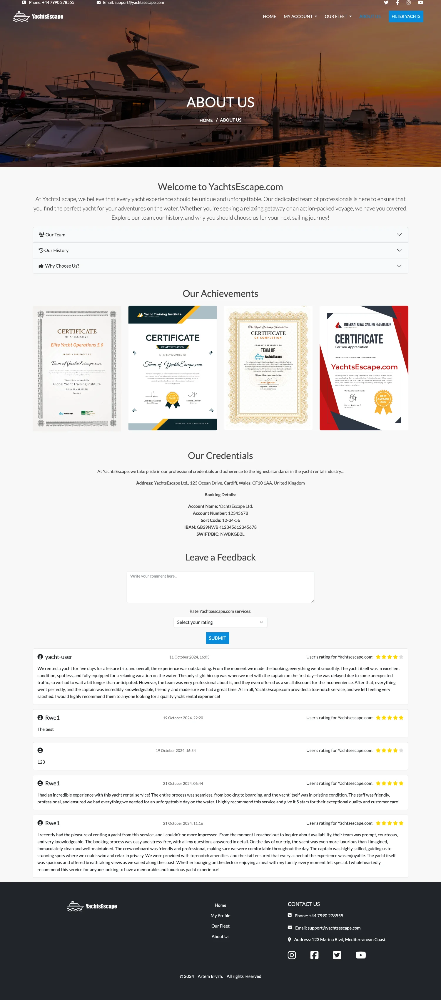
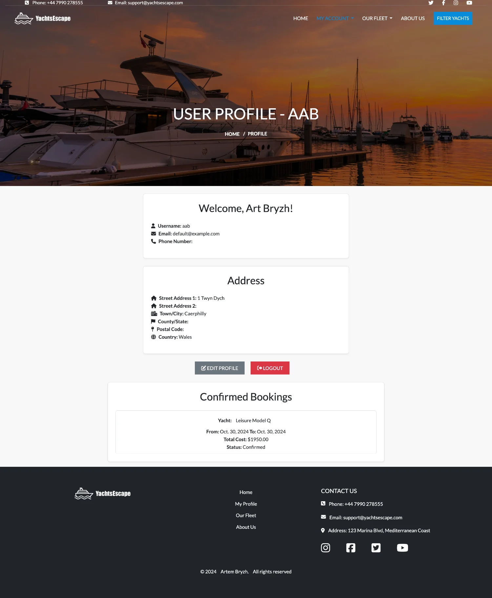
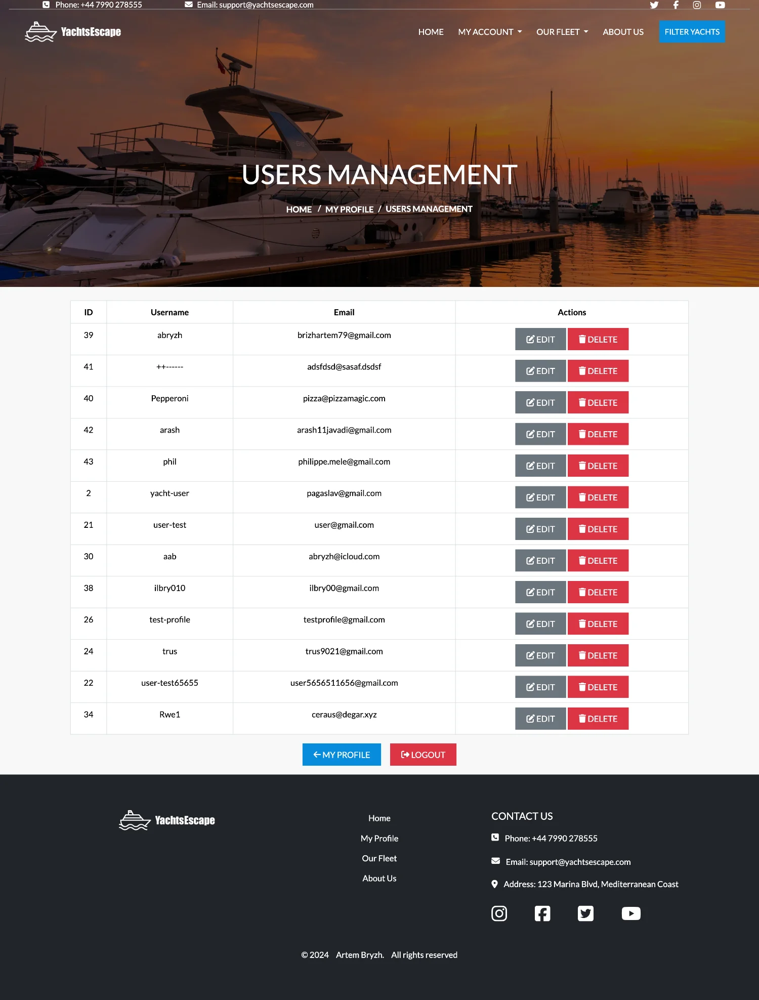
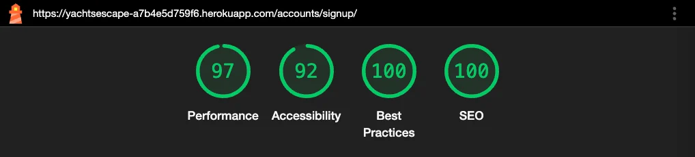

# Yachtsescape README


View the live site [here](https://yachtsescape-a7b4e5d759f6.herokuapp.com/)

## Introduction

Welcome to YachtsEscape, your premier destination for discovering and booking luxury yacht rentals. Our platform is designed to provide users with an effortless experience, from searching for the perfect yacht to securing your booking. Whether you're planning a tranquil getaway or an adventurous voyage, YachtsEscape.com offers a wide selection of yachts to suit every preference.

## UX

The website was designed to be both visually appealing and easy to navigate. Users can quickly browse through a wide selection of yachts and find the one that fits their needs. The focus is on providing a seamless experience, allowing users to book yachts without any hassle. The website's layout is simple and intuitive, ensuring that users can understand and use it effortlessly. Special deals and offers are highlighted to encourage users to make bookings and become repeat customers. The site is also built with scalability in mind, making it adaptable for future growth and allowing the management team to handle different roles efficiently.

## Target Audience

This website is designed for people who are looking to rent yachts for various occasions, such as leisure trips, celebrations, or fishing adventures. It aims to attract both casual users who are booking for the first time, and loyal customers who enjoy regular yacht trips. We make it easy to search for yachts by type, location, and capacity, ensuring that users can find the perfect fit for their needs. The website also offers special deals and a smooth booking process, making yacht rentals accessible and hassle-free for everyone.

## Business Model

The business model is B2C, meaning that the company focuses on offering yacht rentals directly to customers. It emphasizes individual transactions, allowing customers to browse, select, and book yachts easily.

### Revenue Streams

The primary revenue stream for **YachtsEscape** comes from yacht rentals. Additional revenue is generated through premium services, such as luxury packages or extended rental periods, and potential partnerships with yacht owners for exclusive listings.

### Customer Acquisition Strategy

**YachtsEscape** attracts customers through targeted online marketing campaigns, search engine optimization (SEO), and partnerships with travel agencies. Additionally, repeat customers are encouraged to use the platform through loyalty programs and special discounts.

### Partnerships

The platform builds strategic partnerships with yacht clubs, marina operators, and event planners to offer customers an all-inclusive experience. These partnerships allow the platform to expand its range of yachts and provide unique packages for special occasions.

### A Persona Summary of the Customer

**YachtsEscape** caters to individuals looking for yacht rentals for various purposes, including leisure, celebrations, or fishing trips. The typical customer is someone 18 or older, seeking a unique experience on the water. The platform is designed with user-friendliness in mind, making it easy for customers to find the right yacht based on their needs, compare options, and receive excellent service throughout the process. Customers value the clear yacht descriptions, high-quality images, and simple booking process.

### A Persona Summary of the Company Personnel

**YachtsEscape** aims to support small and large companies interested in offering yacht rentals. As the platform scales, it includes features for personnel to manage listings, bookings, and customer service effectively. Admins and managers can oversee everything from adding new yachts, updating details, and handling bookings to managing customer inquiries and ensuring smooth operations.

### Value Proposition

**YachtsEscape** offers a curated selection of yachts for every occasion, from intimate family trips to large-scale celebrations. The platform’s ease of use, combined with its extensive yacht options and top-tier customer service, ensures that customers have a premium experience from start to finish.

### Key Metrics

The platform focuses on key metrics such as:
- Number of bookings per month
- Customer satisfaction ratings
- Repeat customer rate
- Yacht availability and maintenance levels
- Time spent on the platform by users

### Growth Plan

The future growth plan includes expanding the range of yachts available to cover more regions and offering new features like yacht-related experiences (e.g., guided tours or fishing expeditions). The platform will also invest in improving its user interface, ensuring a seamless experience for mobile users.

## Mindmap of YachtsEscape.com


## Project Goals

The primary goal of YachtsEscape.com is to make yacht rentals accessible and straightforward for both users and administrators. Our objectives include:

1. **User-Friendly Yacht Search**: Provide a seamless search experience for users, allowing them to find available yachts quickly and easily by filtering results based on location, date, price, and other preferences.

2. **Streamlined Booking Process**: Ensure that users can book yachts effortlessly, with a clear and intuitive process that includes instant booking confirmations and secure payment options.

3. **Comprehensive Yacht Information**: Offer detailed and accurate information about each yacht, including photos, specifications, and user reviews, helping users make informed decisions.

4. **Efficient Account Management**: Empower users to manage their accounts effectively, including access to booking history, saved yachts, and personalized settings, ensuring a personalized experience.

5. **Proactive User Engagement**: Keep users engaged with notifications about new yachts, special offers, and promotions, encouraging them to return and explore more options regularly.

6. **Robust Admin Tools**: Equip administrators with the tools they need to manage yacht listings, user accounts, bookings, and payments efficiently, maintaining the accuracy and integrity of the platform.

7. **Reliable Reporting and Analytics**: Provide administrators with comprehensive reporting features to analyze user activity, booking trends, and financial transactions, enabling data-driven decisions for platform improvement.

Our mission is to create a platform that not only simplifies the yacht rental process but also enhances the overall experience for both users and administrators, ensuring a smooth and enjoyable journey from search to booking.

## User Stories

### First Time Visitor

| Issue ID | User Story |
|----------|------------|
| #1       | As a First Time Visitor, I want to quickly understand what YachtsEscape is, so that I can start exploring yacht rental options without feeling lost. |
| #2       | As a First Time Visitor, I want to easily search for available yachts by location and date, so that I can find the perfect yacht without any hassle. |
| #3       | As a First Time Visitor, I want detailed information about each yacht, including photos, specifications, and reviews, so that I can make an informed decision. |
| #4       | As a First Time Visitor, I want to learn more about the company, so that I can feel confident in renting a yacht from them. |
| #5       | As a First Time Visitor, I want to easily find the company's contact information, so that I can reach out with any questions. |

### Returning Visitor

| Issue ID | User Story |
|----------|------------|
| #6       | As a Returning Visitor, I want to log back in and pick up where I left off, so that I can continue my yacht search or finalize a booking. |
| #7       | As a Returning Visitor, I want to quickly rebook a yacht I’ve rented before, so that I don’t have to search for it again. |
| #8       | As a Returning Visitor, I want to manage my wishlist easily, so that I can keep track of yachts I’m interested in. |
| #9       | As a Returning Visitor, I want to subscribe to updates about new yacht listings and special offers, so that I can stay informed. |

### Registered User

| Issue ID | User Story |
|----------|------------|
| #10      | As a Registered User, I want to receive notifications about new yachts, discounts, and promotions, so that I can stay ahead of the best deals. |
| #11      | As a Registered User, I want to manage my account settings and preferences easily, so that I can tailor the experience to my needs. |
| #12      | As a Registered User, I want to quickly access my booking history, so that I can review past rentals or rebook a favorite yacht. |

### Admin

| Issue ID | User Story |
|----------|------------|
| #13      | As an Admin, I want to keep the yacht listings up to date, so that users always see accurate and available options. |
| #14      | As an Admin, I want to manage user accounts, so that I can maintain the integrity of the platform. |
| #15      | As an Admin, I want to manage all bookings, so that I can help users and keep everything organized. |
| #16      | As an Admin, I want to track and manage payments, so that I can ensure all transactions are processed correctly. |
| #17      | As an Admin, I want to generate reports on user activity, bookings, and payments, so that I can make informed decisions about future improvements. |

## MoSCoW Prioritization

I used MoSCow prioritization to organize each iteration of my project.

### Must Have

- **Design and implement a relational data model**: I'll need to design the database structure that fits the needs of the yacht rental service, making sure it can store, manage, and manipulate all relevant data.
  
- **Authentication, authorization, and permission features**: It’s essential that I handle who can log in, what they can do, and protect sensitive areas of the site. I’ll be making sure that only authorized users can make bookings or manage content.

- **E-commerce payment system**: I'll implement a payment system that allows users to securely book and pay for yacht rentals directly through the site.

- **Use version control (Git) and deploy to the cloud**: I’m documenting everything in Git, making regular commits, and hosting the project on a cloud platform like Heroku.

### Should Have

- **Full-stack web app using Django**: I’ve designed a multi-app Django project with a relational database and user interactions.

- **Accessible and user-friendly front-end**: I'm ensuring the site is designed with accessibility in mind and provides a smooth user experience.

- **Forms for users**: I'll have forms with validation, allowing users to submit and edit information easily.

- **Clean code**: I'll make sure the code follows Django conventions and is easy to maintain.

- **Custom Python logic**: I'll include Python functions with logic like loops and conditions to handle the yacht rental process and bookings efficiently.

- **Testing**: I'll run tests to check that everything works properly—from responsiveness to data management.

- **Database design**: I've created a database schema that shows clear relationships between yachts, users, and bookings.

- **CRUD functionality**: I'll provide the ability to create, read, update, and delete records like yachts and bookings, making sure the system works smoothly for both admins and users.

### Won’t Have

- **Referral system**: This feature is something I’m skipping for now, as it’s not critical to the core of the project.

## Project Setup
### 1. Commitizen Setup
- Installed **Commitizen** and **cz-customizable** for standardized commit messages.
- Created and configured `.cz-config.js` to define commit types and scopes.

### 2. Virtual Environment
- Created a virtual environment for the project to manage dependencies.
- Added the `env` directory to `.gitignore` to prevent tracking of the virtual environment files.

### 3. Django Installation
- Installed **Django** version 5.1.1 to start developing the application.

### 4. Project Initialization
- Began the project setup for YachtsEscape.com, aimed at providing a platform for yacht rentals.

#### Running the Django Application

To start the Django application, follow these steps:

1. **Activate the Virtual Environment:**
   Make sure your virtual environment is activated. Run the following command:

   - **For Windows:**
     ```bash
     .\env\Scripts\activate
     ```

   - **For macOS and Linux:**
     ```bash
     source env/bin/activate
     ```

2. **Run the Development Server:**
   Once the virtual environment is activated, you can start the Django development server with the following command:

   ```bash
   python3 manage.py runserver

## User Experience (UX) & User Interface (UI)

### Wireframes

<details>
<summary>Home Page</summary>


</details>

<details>
<summary>Log in Page</summary>


</details>

<details>
<summary>Sign Up Page</summary>


</details>

<details>
<summary>Our Fleet Page</summary>


</details>

<details>
<summary>About Us Page</summary>


</details>

<details>
<summary>Profile Page</summary>


</details>

<details>
<summary>Yacht management Page</summary>


</details>

<details>
<summary> Yacht Detail Page</summary>


</details>

<details>
<summary>Booking success Page</summary>


</details>
<summary>Map of website</summary>


</details>

### Colour Scheme

#### Color Palette
The color palette for YachtsEscape was chosen to give the site a clean, professional look, while keeping it tied to the theme of yachting. Here are the main colors:

- **Primary Color:** #088cdc (Light Blue) – Inspired by the sea, this color feels fresh and calm. It's used for buttons, icons, and other important elements to give the site a bright, welcoming feel.
- **Secondary Color:** #006bb3 (Deep Blue) – This darker blue adds depth and trust. It's used for the logo, hover states, and interactive elements.
- **Text Color:** #444444 (Dark Grey) – Used for main body text, this grey keeps things readable without being too harsh.
- **Background Color:** #f8f8f8 (Light Grey) – A soft, neutral background that lets the content shine without being distracting.
- **White:** Mainly used for text on dark backgrounds like the footer and image sections, creating strong contrast for easy reading.
- **Footer Background:** #000000 (Black) – The footer uses black to make the white text stand out and give the site a solid base.

#### Visual Harmony and Accessibility
- **Contrast and Readability:** High contrast between text and background ensures everything is easy to read. The white text on dark sections like the footer improves visibility.
- **Balance:** Blue dominates the design, while grey and white keep the layout clean and focused.
- **Consistency:** The color scheme is consistent throughout, reinforcing the brand identity and making navigation intuitive.
- **Accessibility:** The colors meet accessibility standards, ensuring the site is usable for everyone, including those with visual impairments.


#### Visual Harmony and Accessibility

- **Contrast and Readability**: Ensure there is sufficient contrast between the primary color (Green) and the accent color (White) for text and important elements to maintain readability.
- **Balance**: Use soft orange sparingly to highlight key actions without overwhelming the natural and calm aesthetic of the site.
- **Consistency**: Maintain a consistent use of colors throughout the website to create a harmonious visual experience that supports the site’s calming and professional atmosphere.
- **Accessibility**: Consider accessibility guidelines, ensuring that all text is readable by maintaining an appropriate contrast ratio and using color combinations that are friendly for users with color vision deficiencies. This includes testing the color palette with accessibility tools to verify compliance with WCAG standards.

### Typography

The primary font used throughout the site is [**Lato**](https://fonts.google.com/specimen/Lato), a Google Font, chosen for its clean and modern look, ensuring readability across all devices. It comes in various weights (100, 300, 400, 700, 900) to give flexibility in styling headings, body text, and other elements.


For icons, I use [**Font Awesome**](https://fontawesome.com/), which adds clarity and visual appeal to buttons, social media links, and navigation elements.

### YachtsEscape Logo

The **YachtsEscape** logo features a sleek, modern design with a minimalist illustration of a yacht, combined with bold typography. The yacht symbol uses a clean blue (#088cdc) color, which represents the ocean, aligning with the overall maritime theme of the website. The bold black text beside the yacht adds a professional touch, making the brand name stand out clearly.

There are two variations of the logo:

- **Light Version**: This version is used against dark backgrounds, such as in the initial state of the header and in the footer of the website.
- **Dark Version**: This version appears against lighter backgrounds, such as when the user scrolls down and the header becomes fixed on a white background.


The logo dynamically changes between these versions based on the user's scroll position and screen width, enhancing the website's aesthetic and functionality.

Below is the JavaScript code that switches between the light and dark versions of the logo as the user interacts with the page:

```javascript, static/js/base.js
// Function to change the logo based on scroll position and window width
function updateLogo() {
    let windowWidth = $(window).width();
    let scrollTop = $(window).scrollTop();
    let lightLogo = $("#logo").data("light-logo");
    let darkLogo = $("#logo").data("dark-logo");
    let smallLightLogo = $("#logo").data("small-light-logo");
    let smallDarkLogo = $("#logo").data("small-dark-logo");

    if (scrollTop > scrollTrigger) {
        // Change logo to dark version based on screen size
        if (windowWidth < 689) {
            $("#logo").attr("src", smallDarkLogo);
        } else {
            $("#logo").attr("src", darkLogo);
        }
    } else {
        // Change logo to light version based on screen size
        if (windowWidth < 689) {
            $("#logo").attr("src", smallLightLogo);
        } else {
            $("#logo").attr("src", lightLogo);
        }
    }
}
```

## Features

### Navigation
The navigation panel of Yachtsescape rental website is designed to provide a user-friendly and intuitive browsing experience.

#### Navbar
The Navbar is composed of two main parts: the **Top Bar** and the **Main Navigation**.

##### Top Bar
The **Top Bar** provides quick access to essential contact information and social media links:


- **Phone and Email**: 
  - Users can quickly dial the phone number or email YachtsEscape with one click from the top bar.
  - These contact options are visible on all screen sizes, ensuring accessibility.
  
- **Social Media Links**: 
  - Links to Twitter, Facebook, Instagram, and YouTube are available, each opening in a new window. The icons are styled using FontAwesome and aligned on the right of the top bar for convenience.

##### Main Navigation
The **Main Navigation** is designed to be responsive and intuitive:


- **Brand Logo**: 
  - The logo is positioned on the left side of the navbar, dynamically changing based on scrolling. When the user scrolls past 50px, the logo transitions from light to dark (or small versions on mobile), thanks to the custom JavaScript code in `base.js`.

- **Menu Behavior**: 
  - The menu adapts responsively, converting into an off-canvas (sidebar) menu on smaller devices. The menu's hamburger icon becomes visible on mobile devices, ensuring the navigation is accessible across screen sizes.
  
- **Dynamic Menu Based on User Status**:
  - If the user is authenticated, an account dropdown is displayed with links to profile for all users and management pages for admin users.


  - If the user is not authenticated, a **Sign In** button appears instead.


- **Yacht Fleet Menu**: 
  - The **Our Fleet** section is a dropdown that categorizes yachts by type (Leisure, Fishing, Celebrations), allowing users to filter yachts according to their preferences.


- **Filter Yachts Button**: 
  - A prominent **Book Now** button is available, leading to a modal with a filter form. This form allows users to filter yachts by type, capacity, and availability using intuitive date pickers.


##### Layout and Responsiveness

- The **Main Navigation** and **Top Bar** are designed to collapse elegantly on smaller screens, with all elements accessible via the off-canvas sidebar.


- The **Logo**, **Menu Items**, and **Filter Yachts** button are designed to shift layout based on screen size, ensuring a consistent and responsive experience for users on all devices.


The navigation ensures quick access to essential services and an intuitive flow, enhancing the user journey across the site.

### Footer

The footer section of **YachtsEscape** provides essential information, including contact details and easy access to our social media channels. Here's a breakdown of its layout and functionality across different devices:

##### Desktop View:


- **Logo and Company Name**: 
  - Positioned on the left side of the footer, the **YachtsEscape** logo is displayed prominently to enhance brand visibility.

- **Navigation Links**:
  - Located centrally, visitors can find key navigation links such as:
    - Home
    - My Profile (if logged in)
    - Our Fleet
    - About Us

- **Contact Information**: 
  - On the right, contact details include:
    - **Phone**: +44 7990 278555
    - **Email**: support@yachtsescape.com
    - **Address**: 123 Marina Blvd, Mediterranean Coast

- **Social Media Icons**:
  - Social media icons for Instagram, Facebook, Twitter, and YouTube provide quick access to our profiles.

- **Copyright**:
  - The footer includes a copyright notice: "© 2024 Artem Bryzh. All rights reserved." 
  - A link to the LinkedIn profile of the site creator is also provided.

##### Tablet View:


- **Logo and Navigation Links**:
  - The logo and navigation links are centrally aligned for a balanced layout.

- **Contact Information**:
  - Positioned similarly to the desktop version, but more compact.

- **Social Media Icons**:
  - Icons are displayed below the contact information, allowing easy access on medium-sized screens.

##### Mobile View:


- **Logo**: 
  - The **YachtsEscape** logo is centrally placed at the top for brand recognition.

- **Navigation Links**: 
  - Displayed in a simplified vertical layout for easier navigation.

- **Contact Information**: 
  - Aligned centrally, with the same phone, email, and address details.

- **Social Media Icons**:
  - Arranged horizontally, ensuring users can easily find and interact with them on smaller screens.

The footer is fully responsive and designed to provide a seamless experience across all device types, ensuring users can quickly find essential information and stay connected through social media.

### Home Page


The home page of **YachtsEscape** is designed to provide a seamless and informative experience for users looking to rent yachts. Below is a detailed description of its sections and features:

#### Introduction Section:
- **Hero Section**: 
  - Includes a welcome message and a prominent button labeled "Explore More" that links to the "About Us" page.
  - The background features a large, visually appealing image, creating an immersive experience for users.

#### Search Form Section:
- **Search for Yachts**: 
  - A form allowing users to filter yachts by boat type, capacity, and location, making it easy to find the right yacht.
  - Includes dropdown menus for:
    - Boat type (Celebrations, Fishing, Leisure)
    - Capacity (Up to 8, More than 8)
    - Location (Turkey, France, Spain)

#### Featured Services Section:
- **Introduction to Services**: 
  - Highlights the company's commitment to providing a premium fleet of yachts.
  - Features a list of benefits, such as:
    - Stunning Cruise Paths
    - Premium Boats & Yachts
    - Professional Approach
    - Quality Service

#### Core Benefits:
- **Icons Representing Three Key Benefits**:
  - **Priceless Experience**: Luxury and relaxation through premium services.
  - **Custom Packages**: Tailored packages to meet diverse needs.
  - **People-Oriented Service**: Customer satisfaction is a top priority.

#### Featured Yachts:
- **Featured Yachts Section**: 
  - Displays a selection of featured yachts with images, names, prices, and locations.
  - Includes a "View Details" button for each yacht, allowing users to learn more about individual yachts.

#### Deal of the Week:
- **Exclusive Offer**: 
  - Features a "Deal of the Week" yacht with a limited-time offer, encouraging users to take advantage of the special price.
  - Provides key details such as location, type, capacity, and price.

#### Testimonials:
- **Customer Reviews**: 
  - A carousel featuring testimonials from satisfied customers who share their experiences with **YachtsEscape**.
  - Each testimonial includes a photo of the customer and a short review.

The home page provides an inviting and user-friendly interface that highlights the best of **YachtsEscape's** offerings, guiding users through the yacht rental process with ease.

### Sign In Page


The **YachtsEscape** Sign In page allows users to log into their accounts quickly and easily. It includes the following features:

1. **Username Input**: 
   - Field for entering the username.

2. **Password Input**: 
   - Field for entering the password.

3. **Sign In Button**: 
   - Submits the form to log the user in.

4. **Home Button**: 
   - Returns the user to the homepage without logging in.

5. **Forgot Password Link**: 
   - Provides a link to reset the password.

6. **Sign Up Prompt**: 
   - A link to sign up for new users.

If the credentials are valid, the user is logged in; otherwise, an error message is displayed. The page is simple and responsive, ensuring easy access on any device.

### Sign Up Page
The sign-up page allows new users to create an account on The Knee Surgery website. The form includes client-side validation using JavaScript to ensure the password meets the criteria and matches the confirmation password. The backend handles additional validation, password hashing, and user creation.

### Sign Up Page


The **YachtsEscape** Sign Up page allows new users to create an account. The page includes the following features:

1. **Username, First Name, Last Name**: 
   - Input fields for entering a username, first name, and last name.

2. **Email Input**: 
   - Field for entering an email address.

3. **Password and Confirm Password**: 
   - Password fields with real-time validation.
   - A list of password requirements (minimum 8 characters, at least one uppercase letter, and one number) is displayed under the password field.
   - **Interactive Password Validation**: 
     - As the user types, the password requirements change color from red to gray, indicating which rules have been met.


     - Clicking the eye icon allows the user to toggle password visibility for easier input.


4. **Address Details**:
   - Optional fields for entering street address, city, postal code, and country.

5. **Phone Number**: 
   - Optional phone number input field.

6. **Sign Up Button**: 
   - Submits the form to create an account.

7. **Sign In and Home Links**: 
   - A link to sign in if the user already has an account and a link to return to the homepage.

The form includes validation for required fields and password strength, ensuring that users meet the necessary criteria before submitting. Errors are displayed clearly if any fields are not filled out correctly.

### Our Fleet Page


The **Our Fleet** page on **YachtsEscape** allows users to browse through available yachts and filter them by location, capacity, and price. Below is a breakdown of its key features:

1. **Title and Breadcrumb Navigation**:
   - A clear title "Our Fleet" is displayed at the top.
   - Breadcrumbs help users navigate back to the homepage or other sections.

2. **Filters**:
   - **Location Filter**: A dropdown menu allows users to filter yachts by location (e.g., Turkey, France, Spain).
   - **Capacity Filter**: Another dropdown helps users select yachts based on the number of guests they can accommodate (e.g., up to 8 guests, more than 8 guests).
   - **Sort Options**: Users can sort yachts by price (low to high or high to low) and by rating (low to high or high to low).

3. **Yacht Listings**:
   - Each yacht is displayed in a card format with the following information:
     - **Yacht Image**: A high-quality image of the yacht (or a placeholder if an image is not available).
     - **Rating**: A 5-star rating system overlaid in the top-right corner of the yacht image.
     - **Yacht Name**: The name of the yacht is prominently displayed.
     - **Price**: The price per day in USD is shown beneath the name.
     - **Location, Capacity, and Amenities**: A list of key details such as the yacht's location, guest capacity, number of bedrooms, and available kitchen equipment.
     - **View Details Button**: A button labeled "VIEW DETAILS" directs users to the individual yacht's detail page.

4. **No Yacht Available Message**:
   - If no yachts match the selected filters, a message is displayed informing the user that no yachts are available.

This page provides a clean and user-friendly experience, allowing customers to easily filter and find the perfect yacht for their needs.

### Yacht Detail Page


The **Yacht Detail** page on **YachtsEscape** provides all the necessary information about each yacht, including availability and booking options. Below are the key features of the page:

1. **Yacht Information**:
   - Each page displays detailed information about the yacht, such as type, capacity, location, and price.
   - There is an image gallery where users can click on any photo to view it in a larger size, with navigation options to scroll through the photos. This enhances the user experience by allowing a closer look at the yacht.

2. **Booking Calendar**:
   - **Booked Dates**: Dates that are already booked are fetched from the database and sorted chronologically using JavaScript, making the interface user-friendly.


   - **Interactive Calendar**: When selecting dates, users are presented with an interactive calendar powered by Flatpickr. Booked and past dates are disabled for selection, ensuring only available dates can be chosen.

3. **Conditional Logic for Booking**:


   - If the user is not logged in, the date selection fields and the "Book Now" button are hidden. Instead, a message prompts the user to log in or register an account to proceed with the booking.

4. **Booking Form**:
   - Users can select available dates and fill out the booking form.
   - Clicking the **Book Now** button redirects users to a payment page powered by Stripe, where they can complete their booking securely.

5. **Yacht Image Gallery**:


   - Clicking on any image opens it in a larger format, and users can scroll through the gallery. This feature improves the visual experience and allows for detailed viewing of the yacht.

This page allows users to easily access yacht information, check availability, and make bookings. The integration of a calendar and image gallery, along with secure Stripe payments, ensures a seamless user experience. If a user is not authenticated, they are prompted to log in or create an account before accessing booking options.

### About Us Page



The **About Us** page on **YachtsEscape** provides insight into the company, its team, history, and why customers should choose them. Below are the key sections:

1. **Welcome Section**:
   - The page begins with a brief introduction about **YachtsEscape**, highlighting their mission to offer unique and unforgettable yacht experiences.

2. **Our Team**:
   - An accordion section showcases the team, including a group photo and a description of the team's dedication to finding the best yachts for clients.
   - The team excels at providing professional service, ensuring every yacht rental is a memorable experience.

3. **Our History**:
   - This section details **YachtsEscape's** journey since 2010, emphasizing the growth of their fleet and the commitment to delivering personalized yacht experiences.

4. **Why Choose Us**:
   - This accordion item explains how **YachtsEscape** offers exceptional service and insider knowledge, helping customers discover hidden gems and avoid tourist traps during their yacht adventures.

5. **Our Achievements**:
   - Features images of diplomas and awards that can be enlarged by clicking on them.

6. **Credentials**:
   - Displays British credentials including the company's address and banking details, adding a professional touch to their reputation.

7. **Feedback Section**:


   - Authenticated users can leave comments and rate their experience, while unauthenticated users are prompted to sign in or register.


This page helps build trust by providing customers with detailed information about the team, history, and achievements of **YachtsEscape**, along with a user-friendly layout and interactive elements.

#### Profile Page

The **Profile Page** allows users to view their personal details and past bookings.



- **User Information**: Displays the user's username, email, phone number, and address.
- **Profile Actions**: Users can edit their profile or log out using accessible buttons.
- **Confirmed Bookings**: Shows a list of confirmed bookings with details such as yacht name (linked to the yacht detail page), start and end dates, total cost, and booking status. Each action requires user confirmation through a modal window.

#### Edit Profile Page

The **Edit Profile Page** lets users update their personal information.


- **Form Fields**: Editable fields for username, email, and address.
- **Save Changes**: Changes are confirmed through a modal window before being saved.


- **Cancel Option**: Users can cancel their edits and return to their profile page.

#### Yacht Management (Admin Only)

The **Yacht Management** page allows administrators to manage yacht listings.


- **Yacht List**: A table showing all yachts with options to edit or delete each yacht.
- **Add Yacht**: Admins can add new yachts through a button that leads to the **Add Yacht** page.
- **Confirmation Modals**: Actions like editing and deleting yachts are confirmed through modal windows.

#### Add Yacht Page

The **Add Yacht Page** allows admins to add new yachts to the system.


- **Yacht Form**: A form for adding yacht details, including name, type, and images.
- **Add Yacht Confirmation**: Admins must confirm the addition of a new yacht via a modal window before the yacht is saved.

#### Edit Yacht Page

The **Edit Yacht Page** allows admins to update yacht information.


- **Yacht Form**: Editable fields for yacht details, such as name and type.
- **Save Changes**: Changes must be confirmed through a modal window before being applied.
- **Cancel Option**: Admins can cancel the edit and return to the yacht management page.

#### Delete Yacht (Admin Only)

Yacht deletion is handled through the **Yacht Management** page.


- Admins can trigger the deletion process using a delete button next to each yacht in the list.
- A confirmation modal appears, and upon confirmation, the yacht is removed.

#### User Management (Admin Only)

The **User Management** page allows administrators to manage user accounts.



- **User List**: Displays a list of users with options to edit or delete each user.
- **Edit and Delete**: Admins can manage user accounts with modal confirmations for each action. After a user is edited or deleted, the admin is redirected to the management page with a success message.

#### Edit User Page

The **Edit User Page** allows admins to update a user's personal information.


- **Form Fields**: Editable fields for username, email, and address.
- **Save Changes**: Admins must confirm changes through a modal before they are saved.
- **Cancel Option**: Admins can cancel the changes and return to the user management page.

#### Delete User (Admin Only)

User deletion is handled through the **User Management** page.


- Admins can delete a user by triggering a modal window for confirmation.
- After the user is deleted, the admin is redirected to the management page with a notification of successful deletion.

### Error Pages


The **YachtsEscape** website includes four custom error pages to handle common HTTP errors in a user-friendly way. Each error page maintains the same design structure, ensuring consistency and ease of navigation across the site.

#### 404 - Page Not Found

- **Message**: "404 - Page Not Found"
- **Description**: This error page appears when the requested page cannot be found.
- **Call to Action**: A button labeled "Go to Home" directs users back to the homepage.

#### 403 - Forbidden

- **Message**: "403 - Forbidden"
- **Description**: This page is displayed when the user attempts to access a resource they do not have permission to view.
- **Call to Action**: A "Go to Home" button allows users to return to the homepage.

#### 500 - Internal Server Error

- **Message**: "500 - Internal Server Error"
- **Description**: This error page indicates that something went wrong on the server side. The page suggests trying again later.
- **Call to Action**: A "Go to Home" button is provided for user convenience.

#### 400 - Bad Request

- **Message**: "400 - Bad Request"
- **Description**: This error page shows up when the server cannot process the request due to a malformed syntax.
- **Call to Action**: Users are prompted to click "Go to Home" to return to the homepage.

Each error page features:
- A consistent layout with the **YachtsEscape** branding, including the logo, navigation menu, and social media links.
- A footer with contact information and links to key sections such as "Home," "Our Fleet," and "About Us."

These error pages ensure users can easily find their way back to the main content of the site, even if they encounter an issue.

## Database Design

The project uses a relational database with several key tables to handle user profiles, yacht details, bookings, and reviews. This design ensures a clear relationship between users, yachts, and bookings, facilitating the management of yacht rentals.

### Tables

#### UserProfile Table

This table stores additional information about users registered in the system.

| Field             | Type           | Description                                           |
|-------------------|----------------|-------------------------------------------------------|
| `id`              | SERIAL         | Primary key                                           |
| `user_id`         | INTEGER        | Foreign key referencing the User model                |
| `first_name`      | VARCHAR(30)    | First name of the user (required)                     |
| `last_name`       | VARCHAR(30)    | Last name of the user (required)                      |
| `email`           | VARCHAR(254)   | Email address of the user (required)                  |
| `phone_number`    | VARCHAR(15)    | Optional contact number                               |
| `street_address1` | VARCHAR(255)   | First line of the user's address (required)           |
| `street_address2` | VARCHAR(255)   | Optional second line of the user's address            |
| `town_city`       | VARCHAR(50)    | City or town (required)                               |
| `county_state`    | VARCHAR(50)    | Optional state or county                              |
| `postal_code`     | VARCHAR(20)    | Optional postal or ZIP code                           |
| `country`         | VARCHAR(50)    | Country (required)                                    |

#### Yacht Table

This table stores information about the yachts available for booking.

| Field            | Type        | Description                                           |
|------------------|-------------|-------------------------------------------------------|
| `id`             | SERIAL      | Primary key                                           |
| `name`           | VARCHAR(100)| Name of the yacht                                     |
| `type`           | VARCHAR(50) | Type of the yacht (e.g., motor, sailing)              |
| `location`       | VARCHAR(100)| Location where the yacht is available                 |
| `capacity`       | INTEGER     | Maximum number of people the yacht can accommodate     |
| `price_per_day`  | DECIMAL(10,2)| Daily rental price of the yacht                      |
| `description`    | TEXT        | Detailed description of the yacht                     |

#### Booking Table

This table stores information about user bookings.

| Field              | Type        | Description                                           |
|--------------------|-------------|-------------------------------------------------------|
| `id`               | SERIAL      | Primary key                                           |
| `user_id`          | INTEGER     | Foreign key referencing the User model                |
| `yacht_id`         | INTEGER     | Foreign key referencing the Yacht model               |
| `start_date`       | DATE        | The start date of the booking                         |
| `end_date`         | DATE        | The end date of the booking                           |
| `total_price`      | DECIMAL(10,2)| Total cost calculated based on the booking period     |

#### Review Table

This table allows users to leave reviews for yachts.

| Field            | Type         | Description                                           |
|------------------|--------------|-------------------------------------------------------|
| `id`             | SERIAL       | Primary key                                           |
| `user_id`        | INTEGER      | Foreign key referencing the User model                |
| `content`        | TEXT         | Text content of the review                            |
| `rating`         | INTEGER      | Rating provided by the user                           |
| `created_at`     | TIMESTAMP    | Timestamp of when the review was created              |

### Relationships

- **UserProfile**: Extends the User model to store additional personal information.
- **Yacht**: Represents yachts available for booking.
- **Booking**: Connects users with yachts and stores booking details, including dates and total cost.
- **Review**: Allows users to leave reviews on yachts they have rented.

### Entity Relationship Diagram

#### Custom Entity Relationship Diagram


#### Custom Entity Relationship Diagram


## Technologies Used

- [](https://www.python.org/) is used as the back-end programming language.
- [](https://www.djangoproject.com/) is the Python framework used for the site.
- [](https://developer.mozilla.org/en-US/docs/Web/HTML) was used as the foundation of the site.
- [](https://developer.mozilla.org/en-US/docs/Web/CSS) was used to add styles and layout to the site.
- [](https://getbootstrap.com/docs/5.3) was employed to integrate its styles, facilitating rapid development and consistent styling across the pages.
- [](https://developer.mozilla.org/en-US/docs/Web/JavaScript) was employed to implement dynamic interactions on the site.
- [](https://jquery.com/) was used for user interaction on the site.
- [](https://dbs.ci-dbs.net) was used as the Postgres database from Code Institute.
- [](https://code.visualstudio.com/) was used as the main tool to write and edit code.
- [](https://git-scm.com/) was used for the version control of the website.
- [](https://github.com/) was used to host the code of the website.
- [](https://dashboard.heroku.com/apps) is hosting the deployed back-end site.
- [](https://whitenoise.readthedocs.io) used for serving static files with Heroku.
- [](https://cloudinary.com) used for online media file storage.
- [](https://stripe.com) used for online secure payments of ecommerce products/services.
- [](https://mail.google.com) used for sending emails in my application.
- [](https://balsamiq.com/) was used to make wireframes for the website.
- [](https://www.adobe.com/uk/products/photoshop.html) was used to create and resize images for the website and the README file.
- [](https://www.icoconverter.com/) was used to generate the favicon.
- [](https://developer.chrome.com/docs/devtools/) was used to debug, test responsiveness, and generate Lighthouse reports.
- [](https://fonts.google.com/) was used to import fonts for the site.
- [](https://fontawesome.com/) was used for all the site icons.
- [](https://validator.w3.org/) was used to validate the HTML code.
- [](https://jigsaw.w3.org/css-validator) was used to validate the CSS code.
- [](https://jshint.com/) was used to detect errors and potential problems in JavaScript code.

## Testing

### Responsiveness

The **YachtsEscape** website was carefully designed and tested to ensure a smooth and seamless experience across different devices and screen sizes. During the responsiveness testing phase, the following screen resolutions were selected for each device type:

- **Desktop**: 1920 x 1080
- **Tablet**: 820 x 1180
- **Mobile**: 390 x 844

These resolutions represent common screen sizes for each device category, ensuring that the website performs optimally on a wide range of devices. Adjustments were made to layout, navigation, and interactive elements to guarantee a consistent and user-friendly experience across all platforms.

<details>
<summary>Home Page</summary>


</details>

<details>
<summary>Sign In Page</summary>


</details>

<details>
<summary>Sign Up Page</summary>


</details>

<details>
<summary>Our Fleet</summary>


</details>

<details>
<summary>About Us Page</summary>


</details>

<details>
<summary>Profile Page</summary>


</details>

<details>
<summary>Edit Profile Page</summary>


</details>

<details>
<summary>Yachts Management Page</summary>


</details>


<details>
<summary>Add Yacht Page</summary>


</details>

<details>
<summary>Edit Yacht Page</summary>


</details>

<details>
<summary>Users Management Page</summary>


</details>

<details>
<summary>Edit Users Profile Page</summary>


</details>

<details>
<summary> 404 Page</summary>


</details>
All error pages on **YachtsEscape** (including 403, 400, and 500) are designed to behave in the same way as the **404 - Page Not Found** page. They share the same layout, navigation, and call-to-action elements, ensuring a consistent user experience. Therefore, only the screenshot of the **404** page is provided for reference.

### Validator testing

#### Python

I have used the recommended [PEP8 CI Python Linter](https://pep8ci.herokuapp.com/) to validate my Python files.

<details>

<summary>manage.py, no errors</summary>


</details>

<details>

<summary>yachtsescape/settings.py, no errors</summary>


</details>

<details>

<summary>yachtsescape/forms.py, no errors</summary>


</details>

<details>

<summary>yachtsescape/urls.py, no errors</summary>


</details>

<details>

<summary>yachts/admin.py, no errors</summary>


</details>

<details>

<summary>yachts/models.py, no errors</summary>


</details>

<details>

<summary>yachts/urls.py, no errors</summary>


</details>

<details>

<summary>yachts/views.py, no errors</summary>


</details>

<details>

<summary>profiles/admin.py, no errors</summary>


</details>

<details>

<summary>profiles/forms.py, no errors</summary>


</details>

<details>

<summary>profiles/models.py, no errors</summary>


</details>

<details>

<summary>profiles/urls.py, no errors</summary>


</details>

<details>

<summary>profiles/views.py, no errors</summary>


</details>

<details>

<summary>home/views.py, no errors</summary>


</details>

<details>

<summary>booking/admin.py, no errors</summary>


</details>

<details>

<summary>booking/apps.py, no errors</summary>


</details>

<details>

<summary>booking/forms.py, no errors</summary>


</details>

<details>

<summary>booking/models.py, no errors</summary>


</details>

<details>

<summary>booking/urls.py, no errors</summary>


</details>

<details>

<summary>booking/views.py, no errors</summary>


</details>

<details>

<summary>booking/webhook_handler.py, no errors</summary>


</details>

<details>

<summary>booking/webhooks.py, no errors</summary>


</details>

#### HTML
I have used the recommended [HTML W3C Validator](https://validator.w3.org/) to validate all of my HTML files.

During the testing and validation phase, an error that occurred in the early stages of writing the HTML code was identified. In the header, I created a class named header, which is considered potentially problematic. So far, I have not noticed any issues related to this. In the next stages of website development, I will, of course, correct this oversight. Since this error is in the header template, it appears on all pages. Otherwise, the code did not produce any more errors, only informational messages and warnings, mostly related to the Django template syntax.

<details>
<summary>Home Page</summary>


</details>

<details>
<summary>Log in Page</summary>


</details>

<details>
<summary>Sign Up Page</summary>


</details>

<details>
<summary>Sign Out Page</summary>


</details>

<details>
<summary>Our Fleet</summary>


</details>

<details>
<summary> Yacht Detail Page</summary>


</details>

<details>
<summary>About Us Page</summary>


</details>

<details>
<summary>Profile Page</summary>


</details>

<details>
<summary>Edit Profile Page, no errors</summary>


</details>

<details>
<summary>Yachts Management Page, no errors</summary>


</details>

<details>
<summary>Add Yacht Page, no errors</summary>


</details>

<details>
<summary>Edit Yacht Page, no errors</summary>


</details>

<details>
<summary>Users Management Page, no errors</summary>


</details>

<details>
<summary>Edit Users Profile Page, no errors</summary>


</details>

The other pages (Yacht Management, User Management, adding yachts, or editing user profiles) are not accessible without administrator privileges, so it was pointless to validate them since the validation would repeatedly check the same page — the login page.

#### CSS
The following CSS files were validated to ensure that the styles used in the **YachtsEscape** project are error-free:

- **base.css**
- **header.css**
- **footer.css**
- **responsive.css**
- **index.css**
- **yacht-list.css**
- **about.css**
- **allauth.css**

The validation process for all styles was smooth and successful. Due to the nature of the project, I found the most straightforward and efficient method to validate each stylesheet was to directly transfer the code via clipboard. The result was the same for every file: 

**"Congratulations! No Error Found."**

Below is the confirmation screenshot for the successful validation:


#### JavaScript
I have used the recommended [JShint Validator](https://jshint.com/) to validate my JS file.

<details>
<summary> static/js/base.js, no errors</summary>


</details>

details>
<summary> static/js/yachts.js, no errors</summary>


</details>

### LightHouse report

#### Home Page

<details>
<summary>Desktop</summary>


</details>
<details>
<summary>Mobile</summary>


</details>

#### Log in Page

<details>
<summary>Desktop</summary>


</details>
<details>
<summary>Mobile</summary>


</details>

#### Sign Up Page

<details>
<summary>Desktop</summary>


</details>
<details>
<summary>Mobile</summary>


</details>

#### Our Fleet

<details>
<summary>Desktop</summary>


</details>
<details>
<summary>Mobile</summary>


</details>

#### Yacht Detail Page

<details>
<summary>Desktop</summary>


</details>
<details>
<summary>Mobile</summary>


</details>

#### About Us Page

<details>
<summary>Desktop</summary>


</details>
<details>
<summary>Mobile</summary>


</details>

#### Profile Page

<details>
<summary>Desktop</summary>


</details>
<details>
<summary>Mobile</summary>


</details>

#### Edit Profile Page

<details>
<summary>Desktop</summary>


</details>
<details>
<summary>Mobile</summary>


</details>

#### Yachts Management Page

<details>
<summary>Desktop</summary>


</details>
<details>
<summary>Mobile</summary>


</details>

#### Add Yacht Page

<details>
<summary>Desktop</summary>


</details>
<details>
<summary>Mobile</summary>


</details>

#### Users Management Page

<details>
<summary>Desktop</summary>


</details>
<details>
<summary>Mobile</summary>


</details>


### Compatibility
In order to confirm the correct functionality, responsiveness, and
appearance:

- The website was tested on the following browsers: Chrome, Firefox,
Safari.

| Browser tested | Intended appearance | Intended responsiveness |
| - | - | - |
| Chrome | Good | Good |
| FireFox | Good | Good |
| Safari | Good | Good |

All pages loaded equally well across these browsers. As an example, the most visually rich page, the yacht listing page, is shown in the screenshot below.

#### Chrome

<details>
<summary>Our Fleet Page Chrome</summary>


</details>

#### Firefox

<details>
<summary>Our Fleet Firefox</summary>


</details>

#### Safari

<details>
<summary>Our Fleet Safari</summary>


</details>


### Manual Testing

For manual testing documentation, please continue to [TEST_SUITE_MANUAL.md](TEST_SUITE_MANUAL.md)

### Resolved Bugs

#### 1. Bug Report: Flatpickr Disabling All Dates

##### Description
A bug was identified in the yacht booking system where the **Flatpickr** date picker was incorrectly disabling all available dates instead of only those with a "confirmed" status. This issue significantly impacted user experience by preventing users from selecting dates that should be available for booking.

##### Steps to Reproduce
1. Open the yacht booking page.
2. Attempt to select a date range using the **Flatpickr** date picker.
3. Observe that all dates are disabled, regardless of their booking status.

##### Expected Behavior
Only dates that have been confirmed as booked should be disabled in the **Flatpickr** date picker. Users should be able to select any available dates for their bookings.

##### Actual Behavior
The **Flatpickr** date picker disabled all dates, making it impossible for users to select any available booking dates.

##### Impact
This bug led to frustration among users trying to make bookings, as it restricted their options unnecessarily.

##### Resolution
The issue was resolved by reviewing the logic used to determine which dates should be disabled in the **Flatpickr** configuration. Now, only dates with a confirmed booking status are included in the array of disabled dates passed to **Flatpickr**, improving user experience.

---

#### 2. Bug Report: Incorrect Webhook URL Preventing Stripe Event Reception

##### Description
A bug was discovered in the **Stripe** integration where the webhook URL configured in the **Stripe** dashboard was incorrect. This resulted in **Stripe** being unable to send events to the designated endpoint in the application.

##### Steps to Reproduce
1. Log in to the **Stripe** dashboard.
2. Navigate to the **Webhooks** section.
3. Verify the webhook URL configured for the application.
4. Trigger a test event from **Stripe** (e.g., a successful payment or checkout session).
5. Observe that no events are received by the application.

##### Expected Behavior
The configured webhook URL in the **Stripe** dashboard should correctly point to the application's webhook endpoint, allowing the application to process events accordingly.

##### Actual Behavior
Due to an incorrect webhook URL, **Stripe** was unable to send events to the application, resulting in no webhook events being processed.

##### Impact
This bug led to the failure of payment processing, causing confusion for users attempting to make bookings.

##### Resolution
The issue was resolved by updating the webhook URL in the **Stripe** dashboard to ensure it matches the correct endpoint in the application. Testing was conducted to confirm that events are now received and processed correctly, restoring proper payment functionality.

---

#### 3. Bug Report: Images Not Displaying on Yacht Details Page

##### Description
A bug was identified on the yacht details page where images were not displaying correctly due to incorrect URLs stored in the **Django** database for the images.

##### Steps to Reproduce
1. Navigate to the yacht details page in the application.
2. Observe that the images meant to showcase the yacht are not visible.
3. Check the HTML source code or use developer tools to inspect the image elements.
4. Verify that the `src` attributes of the image tags contain incorrect or malformed URLs.

##### Expected Behavior
Images should display correctly on the yacht details page, with valid URLs pointing to the images stored in **Cloudinary**.

##### Actual Behavior
The images were not displayed because the URLs retrieved from the **Django** database were incorrect or incomplete, resulting in 404 errors.

##### Impact
This bug negatively impacted user experience by failing to showcase the yacht effectively.

##### Resolution
The issue was resolved by reviewing and updating the database entries to ensure that the URLs for images are correctly formatted and point to the appropriate **Cloudinary** resources. Validation for image URLs was implemented in the **Django** model to prevent future occurrences of this issue. Thorough testing confirmed that images now display correctly.

### Unresolved Bugs

#### Bug Report: Unresolved Issue with Yacht Filtering Allowing Past Dates

##### Description
An unresolved bug was identified on the homepage of the yacht booking system where users are able to filter and select past dates for bookings. This can cause confusion and frustration, as booking yachts for past dates is not possible.

##### Steps to Reproduce
1. Navigate to the homepage of the yacht booking system.
2. Use the date filter to select a booking date.
3. Observe that past dates are selectable in the date picker.
4. Attempt to proceed with the booking process.

##### Expected Behavior
The date filter should block users from selecting past dates. Only current and future dates should be available for selection to ensure valid booking options.

##### Actual Behavior
Users are able to select past dates, allowing them to attempt to book yachts for dates that have already passed.

##### Impact
This bug can lead to user frustration, as they may attempt to book yachts for invalid dates. It can also increase support requests due to booking errors.

##### Suggested Fix
1. Review the logic used in the date filter to ensure past dates are disabled in the date picker.
2. Add validation to prevent bookings with past dates.
3. Test the filtering functionality to ensure it works as expected after the fix.

##### Conclusion
Fixing this bug is crucial for improving the booking experience, ensuring users can only select valid dates and reducing confusion during the process.

---

#### Bug Report: Unresolved Issue on Sign-In Page - No Error Message for Incorrect Credentials

##### Description
A bug was identified on the sign-in page where users do not receive any feedback when they enter an incorrect username or password. This lack of feedback makes it difficult for users to correct their input and try again.

##### Steps to Reproduce
1. Navigate to the sign-in page.
2. Enter an incorrect username or password.
3. Click on the "Sign In" button.
4. Observe that no error message is displayed to inform the user of the invalid credentials.

##### Expected Behavior
The system should display an error message when incorrect credentials are entered, guiding users to correct their input.

##### Actual Behavior
Currently, no feedback is provided when invalid credentials are entered, leading to a confusing experience.

##### Impact
This bug can cause frustration for users, as they may repeatedly attempt to log in without knowing why it fails.

##### Suggested Fix
1. Implement client-side validation to detect invalid credentials.
2. Display a user-friendly error message or notification when invalid credentials are entered.
3. Ensure the error message clearly indicates the issue, helping users correct their input.

##### Conclusion
Fixing this bug is important for enhancing the user experience on the sign-in page by providing immediate feedback when users enter incorrect credentials.

---

#### Bug Report: Unresolved Issue on Yacht Management Page - Fleet Navbar Button Appears Blue

##### Description
A bug was identified on the yacht management page where the "Fleet" navigation button is displayed in blue, even when the user is not on the fleet page. This happens because the URL starts with `/yachts`, incorrectly highlighting the button as active.

##### Steps to Reproduce
1. Log in as an administrator.
2. Navigate to the yacht management page.
3. Observe the "Fleet" button in the navigation bar.
4. Notice that the "Fleet" button is highlighted in blue, even though the user is not on the fleet page.
5. Verify the URL starts with `/yachts`.

##### Expected Behavior
The "Fleet" button should only be highlighted when the user is on the fleet management page. It should reflect the actual active section.

##### Actual Behavior
The "Fleet" button is highlighted incorrectly, confusing users by suggesting they are in the fleet section when they are not.

##### Impact
This can cause confusion for users, as it misrepresents the current page and may lead to navigation issues. However, this issue is only visible to administrators, as the yacht management section is only accessible to users logged in as administrators.

##### Suggested Fix
1. Update the logic for determining which navigation buttons should be active, based on the exact URL.
2. Ensure the "Fleet" button is only highlighted when the user is on the fleet management page.
3. Test the changes to confirm the correct buttons are highlighted.

##### Conclusion
Fixing this bug will improve the navigation experience, ensuring users see the correct section highlighted, reducing confusion within the yacht management page.

### Mistakes

- As I reached the end of this project, I realized the immense benefits of incorporating Agile methodologies for large-scale projects. Agile's iterative approach, flexibility, and focus on collaboration can significantly enhance project management and delivery.

- I plan to dive deeper into Agile practices starting today, right after I submit this project. By adopting Agile techniques, I aim to improve my workflow and better handle complex projects in the future.

- Initially, failed to document encountered bugs promptly during the coding process.
- Realised the importance of documenting bugs in real-time for better tracking and resolution.

- In future projects, I commit to maintaining a detailed log of encountered bugs and their resolution steps throughout the development process.

## Commit Conventions
This project uses [Commitizen](https://github.com/commitizen/cz-cli) to standardize commit messages. The majority of the commits have been made using `git cz`, which helps in maintaining a consistent commit history.

To make a commit using Commitizen, run:
```bash
git cz
```

## Deployment

The live deployed application can be found deployed on [Heroku](https://yachtsescape-a7b4e5d759f6.herokuapp.com/).

### PostgreSQL Database

This project uses a [Code Institute PostgreSQL Database](https://dbs.ci-dbs.net).

To obtain my own Postgres Database from Code Institute, I followed these steps:

- Signed-in to the CI LMS using my email address.
- An email was sent to me with my new Postgres Database.

> [!CAUTION]  
> - PostgreSQL databases by Code Institute are only available to CI Students.
> - You must acquire your own PostgreSQL database through some other method
> if you plan to clone/fork this repository.
> - Code Institute students are allowed a maximum of 8 databases.
> - Databases are subject to deletion after 18 months.

### Stripe API

This project uses [Stripe](https://stripe.com) to handle the ecommerce payments.

Once you've created a Stripe account and logged-in, follow these series of steps to get your project connected.

- From your Stripe dashboard, click to expand the "Get your test API keys".
- You'll have two keys here:
  - `STRIPE_PUBLIC_KEY` = Publishable Key (starts with **pk**)
  - `STRIPE_SECRET_KEY` = Secret Key (starts with **sk**)

As a backup, in case users prematurely close the purchase-order page during payment, we can include Stripe Webhooks.

- From your Stripe dashboard, click **Developers**, and select **Webhooks**.
- From there, click **Add Endpoint**.
  - `https://yachtsescape-a7b4e5d759f6.herokuapp.com/booking/wh/`
I have selected three events:  
- `checkout.session.completed`  
- `payment_intent.payment_failed`  
- `payment_intent.succeeded`
- Click **Add Endpoint** to complete the process.
- You'll have a new key here:
  - `STRIPE_WH_SECRET` = Signing Secret (Wehbook) Key (starts with **wh**)

### Gmail API

This project uses [Gmail](https://mail.google.com) to handle sending emails to users for account verification and purchase order confirmations.

Once you've created a Gmail (Google) account and logged-in, follow these series of steps to get your project connected.

- Click on the **Account Settings** (cog icon) in the top-right corner of Gmail.
- Click on the **Accounts and Import** tab.
- Within the section called "Change account settings", click on the link for **Other Google Account settings**.
- From this new page, select **Security** on the left.
- Select **2-Step Verification** to turn it on. (verify your password and account)
- Once verified, select **Turn On** for 2FA.
- Navigate back to the **Security** page, and you'll see a new option called **App passwords**.
- This might prompt you once again to confirm your password and account.
- Select **Mail** for the app type.
- Select **Other (Custom name)** for the device type.
  - Any custom name, such as "Django" or scrub-savers
- You'll be provided with a 16-character password (API key).
  - Save this somewhere locally, as you cannot access this key again later!
  - `EMAIL_HOST_PASS` = user's 16-character API key
  - `EMAIL_HOST_USER` = user's own personal Gmail email address

### Cloudinary API
This project uses [cloudinary](https://cloudinary.com/) to host media files. 

1. Create a Cloudinary Account

2. Sign up for a Cloudinary account. During registration, select Programmable Media and Files as your intended use.
Set Up Cloudinary in env.py

3. After registration, copy your Cloudinary URL and add it to your env.py file:
  `os.environ.setdefault("CLOUDINARY_URL", "YOUR_CLOUDINARY_URL")`
- Later, transfer this to your Heroku config variables. 
4. In Heroku, add the environment variable:

  `DISABLE_COLLECTSTATIC=1`
5. Install the necessary Cloudinary packages:
  `pip install cloudinary==1.41.0 dj3-cloudinary-storage==0.0.6`
6. Add the following to the INSTALLED_APPS list in the correct order in your settings.py:
  ```python
  INSTALLED_APPS = [
    'django.contrib.admin',
    'django.contrib.auth',
    'django.contrib.contenttypes',
    'django.contrib.sessions',
    'django.contrib.messages',
    'django.contrib.staticfiles',
    'cloudinary_storage',
    'cloudinary',
  ]
  ```


7. Make sure to import Cloudinary at the top of your settings.py:

`import cloudinary`

8. Add cloudinary configuration at the bottom of your static files declation in settings.py:

`cloudinary.config(secure=True, )`

### Flatpickr API


The **Flatpickr** library makes date selection easy and user-friendly in the yacht booking system. Here’s a quick overview of how it works:

#### 1. Easy Setup
Flatpickr is attached to the date input field (`#dateRange`), letting users pick a date range for their yacht booking. It starts working right after the booked dates are loaded, ensuring only available dates are shown.

#### 2. Selecting Dates
Users can select a start and end date for their booking. The system uses the `Y-m-d` date format to keep things consistent.

#### 3. Blocking Booked Dates
The system loads already booked dates from the server and blocks those dates in the calendar, so users can’t select unavailable times.

#### 4. Tracking Selected Dates
Selected dates are saved in a global variable (`selectedDateRange`), making it easy to access and use them throughout the system.

#### 5. Handling Date Changes
When users pick new dates, the system listens for changes and saves the new dates in an array (`dateRange`) to be sent when the booking form is submitted.

#### 6. Booking with Flatpickr
Once the user clicks **Book Now**, the selected dates are sent as part of the booking request. The system handles the submission smoothly.

### Why Flatpickr?

- **User-Friendly**: The calendar is easy to use and makes date picking quick and simple.
- **Error-Free**: Blocked dates help avoid booking mistakes.
- **Flexibility**: Users can select a range of dates, which is important for booking yachts.

Flatpickr improves the booking process by making it easier for users to choose dates and ensuring they can’t book unavailable times.

### Django WhiteNoise
This project uses [Django WhiteNoise](https://whitenoise.readthedocs.io/en/stable/django.html) to serve static files
1. Install Whitenoise using pip:

`pip install whitenoise`

2. Add Whitenoise to the top of your middleware stack, right after the SecurityMiddleware:

```python
MIDDLEWARE = [
  'django.middleware.security.SecurityMiddleware',
  'whitenoise.middleware.WhiteNoiseMiddleware',  # Add this line
  ...
]
```

3. Ensure you have the following static file settings in your settings.py:

```python
# Static file settings
STATIC_URL = '/static/'

# Location where static files are collected
STATIC_ROOT = os.path.join(BASE_DIR, 'staticfiles')
```

4. Run the following command to collect all static files into the STATIC_ROOT directory:

`python manage.py collectstatic`

### Heroku Deployment

This project uses [Heroku](https://www.heroku.com), a platform as a service (PaaS) that enables developers to build, run, and operate applications entirely in the cloud.

Deployment steps are as follows, after account setup:

- Select **New** in the top-right corner of your Heroku Dashboard, and select **Create new app** from the dropdown menu.
- Your app name must be unique, and then choose a region closest to you (EU or USA), and finally, select **Create App**.
- From the new app **Settings**, click **Reveal Config Vars**, and set your environment variables.

> [!IMPORTANT]  
> This is a sample only; you would replace the values with your own if cloning/forking my repository.

| Key | Value |
| --- | --- |
| `DATABASE_URL` | user's own value |
| `DISABLE_COLLECTSTATIC` | 1 (*this is temporary, and can be removed for the final deployment*) |
| `EMAIL_HOST_PASS` | user's own value |
| `EMAIL_HOST_USER` | user's own value |
| `SECRET_KEY` | user's own value |
| `STRIPE_PUBLIC_KEY` | user's own value |
| `STRIPE_SECRET_KEY` | user's own value |
| `STRIPE_WH_SECRET` | user's own value |
| `CLOUDINARY_URL` | user's own value |


Heroku needs three additional files in order to deploy properly.

- requirements.txt
- Procfile
- runtime.txt

You can install this project's **requirements** (where applicable) using:

- `pip3 install -r requirements.txt`

If you have your own packages that have been installed, then the requirements file needs updated using:

- `pip3 freeze --local > requirements.txt`

The **Procfile** can be created with the following command:

- `echo web: gunicorn app_name.wsgi > Procfile`
- *replace **app_name** with the name of your primary Django app name; the folder where settings.py is located*

The **runtime.txt** file needs to know which Python version you're using:
1. type: `python3 --version` in the terminal.
2. in the **runtime.txt** file, add your Python version:
  - `python-3.9.19`

For Heroku deployment, follow these steps to connect your own GitHub repository to the newly created app:

Either:

- Select **Automatic Deployment** from the Heroku app.

Or:

- In the Terminal/CLI, connect to Heroku using this command: `heroku login -i`
- Set the remote for Heroku: `heroku git:remote -a app_name` (replace *app_name* with your app name)
- After performing the standard Git `add`, `commit`, and `push` to GitHub, you can now type:
  - `git push heroku main`

The project should now be connected and deployed to Heroku!

### Local Deployment

This project can be cloned or forked in order to make a local copy on your own system.

For either method, you will need to install any applicable packages found within the *requirements.txt* file.

- `pip3 install -r requirements.txt`.

You will need to create a new file called `env.py` at the root-level,
and include the same environment variables listed above from the Heroku deployment steps.

> [!IMPORTANT]  
> This is a sample only; you would replace the values with your own if cloning/forking my repository.

Sample `env.py` file:

```python
import os


os.environ.setdefault("DATABASE_URL", "user's own value")
os.environ.setdefault("EMAIL_HOST_PASS", "user's own value")
os.environ.setdefault("EMAIL_HOST_USER", "user's own value")
os.environ.setdefault("SECRET_KEY", "user's own value")
os.environ.setdefault("STRIPE_PUBLIC_KEY", "user's own value")
os.environ.setdefault("STRIPE_SECRET_KEY", "user's own value")
os.environ.setdefault("STRIPE_WH_SECRET", "user's own value")
os.environ.setdefault("CLOUDINARY_URL", "user's own value")

# local environment only (do not include these in production/deployment!)
os.environ.setdefault("DEBUG", "True")
os.envirpn.setdefault("DEVELOPNENT", "1")
```

Once the project is cloned or forked, in order to run it locally, you'll need to follow these steps:

- Start the Django app: `python3 manage.py runserver`
- Stop the app once it's loaded: `CTRL+C` or `⌘+C` (Mac)
- Make any necessary migrations: `python3 manage.py makemigrations`
- Migrate the data to the database: `python3 manage.py migrate`
- Create a superuser: `python3 manage.py createsuperuser`
- Load fixtures (if applicable): `python3 manage.py loaddata file-name.json` (repeat for each file)
- Everything should be ready now, so run the Django app again: `python3 manage.py runserver`

If you'd like to backup your database models, use the following command for each model you'd like to create a fixture for:

- `python3 manage.py dumpdata your-model > your-model.json`
- *repeat this action for each model you wish to backup*

#### Cloning

You can clone the repository by following these steps:

1. Go to the [GitHub repository](https://github.com/pagaslav/yachtsescape-com) 
2. Locate the Code button above the list of files and click it 
3. Select if you prefer to clone using HTTPS, SSH, or GitHub CLI and click the copy button to copy the URL to your clipboard
4. Open Git Bash or Terminal
5. Change the current working directory to the one where you want the cloned directory
6. In your IDE Terminal, type the following command to clone my repository:
  - `git clone https://github.com/pagaslav/yachtsescape-com.git`
7. Press Enter to create your local clone.

Alternatively, if using Gitpod, you can click below to create your own workspace using this repository.

[](https://gitpod.io/#https://github.com/pagaslav/yachtsescape-com)

Please note that in order to directly open the project in Gitpod, you need to have the browser extension installed.
A tutorial on how to do that can be found [here](https://www.gitpod.io/docs/configure/user-settings/browser-extension).

## Credits

### Content

#### Yachts

1. Yacht #1, [License.](docs/licenses/yachts/license_certificate_2KUZDV8J7E.txt)
2. Yacht #2, [License.](docs/licenses/yachts/license_certificate_4G9CKHXRSU.txt)
3. Yacht #3, [License.](docs/licenses/yachts/license_certificate_4MULPVWXJ6.txt)
4. Yacht #4, [License.](docs/licenses/yachts/license_certificate_5Y8XNRVCBH.txt)
5. Yacht #5, [License.](docs/licenses/yachts/license_certificate_AYN8FUS2P6.txt)
6. Yacht #6, [License.](docs/licenses/yachts/license_certificate_B72J83QM5R.txt)
7. Yacht #7, [License.](docs/licenses/yachts/license_certificate_CLH2U3PNZF.txt)
8. Yacht #8, [License.](docs/licenses/yachts/license_certificate_CSB76JAZQ9.txt)
9. Yacht #9, [License.](docs/licenses/yachts/license_certificate_JU5CYRXKQD.txt)
10. Yacht #10, [License.](docs/licenses/yachts/license_certificate_MXUJ9RZKS6.txt)
11. Yacht #11, [License.](docs/licenses/yachts/license_certificate_P837RZJHEB.txt)
12. Yacht #12, [License.](docs/licenses/yachts/license_certificate_PBY9L78W3R.txt)
13. Yacht #13, [License.](docs/licenses/yachts/license_certificate_PMFEW8DN5V.txt)
14. Yacht #14, [License.](docs/licenses/yachts/license_certificate_V5NGQ89F4K.txt)
15. Yacht #15, [License.](docs/licenses/yachts/license_certificate_XS8A2CLDG6.txt)
16. Yacht #16, [License.](docs/licenses/yachts/license_certificate_Y6MTFLKCBW.txt)
17. Yacht #17, [License.](docs/licenses/yachts/license_certificate_SQBFDYJL97.txt)

#### People

1. Candid portrait of sailor wearing life jacket, [License.](docs/licenses/people/license_certificate_AYEW2S89Q4.txt)
2. Young smiling fashion woman, [License.](docs/licenses/people/license_certificate_CT3MELNJHP.txt)
3. Hands operating a patient, [License.](docs/licenses/people/license_certificate_L4NGC6BZVS.txt)
4. Knee joint model , [License.](docs/licenses/people/license_certificate_MNE7ZATS3U.txt)
5. Ligament Reconstruction image was generated, [License.](docs/licenses/people/license_certificate_PH3LYKJ5TM.txt)
6. Bandaging woman's injured knee, [License.](docs/licenses/people/license_certificate_Q6HB8WVYJS.txt)

## Acknowledgments

- [Code Institute](https://codeinstitute.net/) tutors and Slack community members for their support and help. A special thank you to Code Institute for their outdated videos, which made the learning process challenging and forced me to figure things out early on. This experience likely saved me from failures in the production phase.

- [Iuliia Konovalova](https://github.com/IuliiaKonovalova), my mentor, for her invaluable advice and guidance during our online meetings.

- [Stack Overflow](https://stackoverflow.com/): For being an indispensable resource for troubleshooting and problem-solving. The community's expertise and willingness to help have been critical to overcoming many technical challenges.
  
- [Kevin Powell](https://www.youtube.com/user/KepowOb) for his amazing CSS tutorials.
  
- - A heartfelt thank you to the creators of [Django](https://www.djangoproject.com/) for developing such a powerful web framework. Its ease of use and robust features not only simplify back-end development but also allow developers to create complex applications with confidence and efficiency.

## Future Improvements

### Future Improvement: Addition of a Model and News Page

#### Overview
To improve user engagement and keep the community informed, the addition of a model and a news page is proposed. This will provide a dedicated space for showcasing new features, updates, and recently added yachts to the fleet.

#### Objectives
- **Inform Users**: Offer a section where users can find updates and new features easily.
- **Showcase Yachts**: Highlight newly added yachts with details and booking options.
- **Enhance Experience**: Keep users engaged with regular updates.

#### Proposed Features

##### 1. Model Addition
- **Dynamic Content**: Create a model to manage news articles and yacht announcements with fields like title, description, image URL, date, and tags.
- **Admin Interface**: Ensure easy management of articles (add, edit, delete) via the admin panel.

##### 2. News Page
- **Display Section**: A dedicated news page with recent articles, thumbnails, descriptions, and filtering options.
- **Detailed View**: Each news item links to a detailed view with more content, images, and booking options.

##### 3. Notifications
- **User Alerts**: Implement notifications to keep users informed about updates and newly added yachts.

#### Conclusion
This addition will enhance user experience by keeping them informed about updates and encouraging them to explore the new yachts, ultimately driving more bookings.

---

### Future Improvement: Discounts and Benefits for Loyal Customers

#### Overview
To reward loyal customers and encourage retention, a loyalty program with discounts and benefits is proposed. This will recognize frequent bookers and motivate them to continue using the platform.

#### Objectives
- **Reward Loyalty**: Offer rewards to frequent users to build long-term relationships.
- **Increase Bookings**: Drive repeat bookings through attractive incentives.
- **Customer Satisfaction**: Provide a better experience by recognizing and rewarding loyalty.

#### Proposed Features

##### 1. Loyalty Program Structure
- **Points System**: Customers earn points for bookings and can redeem them for discounts.
- **Tiered Levels**: Silver, Gold, and Platinum tiers with increasing benefits like discounts and exclusive access to new yachts.

##### 2. Discounts and Offers
- **Discount Codes**: Personalized codes for loyal customers, providing instant savings.
- **Special Promotions**: Exclusive offers like double points weeks or anniversary discounts.

##### 3. Communication
- **Loyalty Dashboard**: A user-friendly dashboard displaying points, tier status, and available rewards.
- **Regular Updates**: Notify customers about new rewards and promotions.

#### Conclusion
A loyalty program will enhance customer satisfaction, encourage repeat bookings, and build a loyal user base that drives business growth.

---

### Future Improvement: Support Channel for Customer Inquiries

#### Overview
To provide better customer support, a dedicated support channel is proposed. This will help users get quick answers to their questions, improving overall satisfaction with the platform.

#### Objectives
- **Improve Accessibility**: Provide easy access to help.
- **Enhance Satisfaction**: Ensure quick responses to reduce frustration.
- **Foster Engagement**: Encourage users to interact with the platform by offering support.

#### Proposed Features

##### 1. Multi-Channel Support Options
- **Live Chat**: Real-time assistance through chat during business hours.
- **Email Support**: A dedicated support email with responses within 24-48 hours.
- **FAQ Section**: A comprehensive FAQ section to help users find answers quickly.

##### 2. User-Friendly Interface
- **Support Widget**: A widget providing quick access to chat, email, and FAQs.
- **Ticketing System**: Allows users to track inquiries and receive notifications.

##### 3. Knowledge Base
- **Resource Library**: Articles, guides, and tutorials to help users navigate the platform.
- **Video Tutorials**: Demonstrations on booking yachts, using the platform, and resolving common issues.

##### 4. Community Forum
- **Customer Forum**: A space where users can share experiences and help each other, enhancing engagement.

#### Conclusion
A dedicated support channel will improve customer satisfaction by providing multiple avenues for assistance, fostering a supportive community, and ensuring that users get the help they need efficiently.